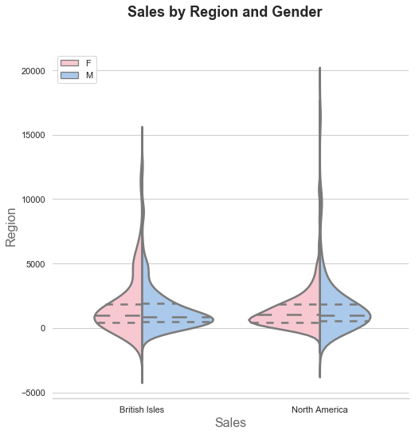
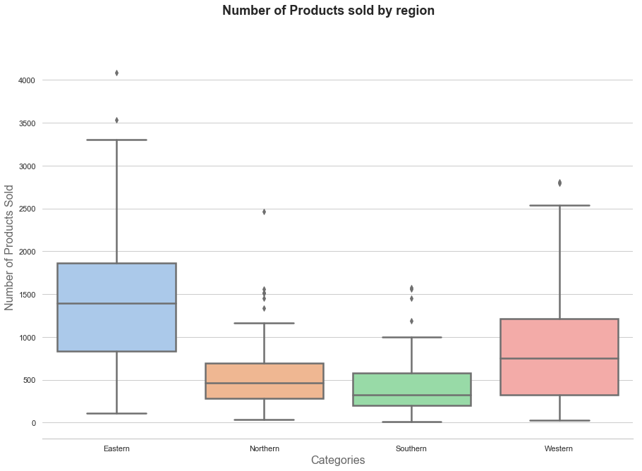
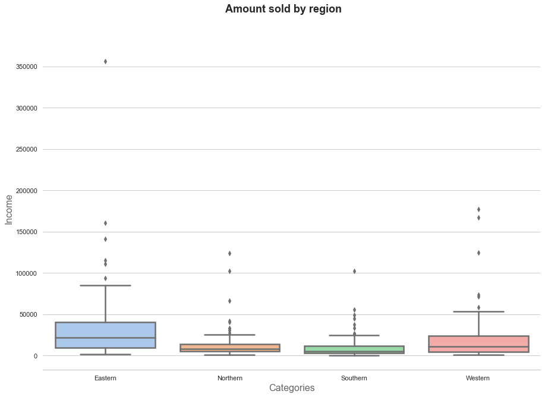
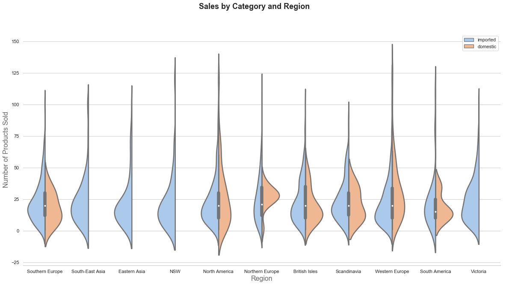

# Project 2 - The Northwind Database
---
Joshua Brancazio

Rafael


------
## Method

For this project, I will start by obtaining my data and doing some quick exploratory work to understand how it is organized. I will then be using the scientific method to plan and organize my hypothesis testing. I will repeat this process for each of my 4 hypothesis. A brief summary of the method is below.


**1. Ask a Question**

I will find a question of interest to the shareholders and develop a null and alternate hypothesis. I will also define my level of significance at this stage.

**2. Do background research**

I will obtain the data needed to answer my question and format it as necessary to prepare it for my test. 

**3. Test with an experiment**

I will run the approproiate test and any post-hoc tests needed to answer my question

**4. Analize Data and Draw conclusions**

I will analyse the outcome, draw any conclusions and point out any further testing that might be needed or interesting.

------------

# Obtain The Data

My goal for this project is to test 4 hypothesis related to the Northwind Traders Co. database. Northwind Traders Co. is a fictional import/export company that sells specialty foods. The schema of this database is below and will be used throughout this process to inform my queries. 


### Connecting to the database

I want to start out by creating my code to connect to the sql database and confirm that the schema above is accurate. I believe that is it good practice to double check and make sure that the schema is up to date.

I do this by creating a list of table names and printing the column information for each table. This is a great secondary referance to use as I create my queries moving forward. 


```python
import sqlalchemy
import sqlite3
from sqlalchemy import create_engine
from sqlalchemy.orm import Session, sessionmaker
from sqlalchemy import inspect
import numpy as np
import matplotlib.pyplot as plt
import seaborn as sns
from scipy import stats
from statsmodels.stats.multicomp import pairwise_tukeyhsd
from statsmodels.stats.multicomp import MultiComparison

engine = create_engine('sqlite:///Northwind_small.sqlite',echo=True) #create connection to sql database
Session = sessionmaker(bind=engine)
session = Session()

inspector = inspect(engine)
con = engine.connect()
```

    2019-01-30 11:30:25,646 INFO sqlalchemy.engine.base.Engine SELECT CAST('test plain returns' AS VARCHAR(60)) AS anon_1
    2019-01-30 11:30:25,647 INFO sqlalchemy.engine.base.Engine ()
    2019-01-30 11:30:25,650 INFO sqlalchemy.engine.base.Engine SELECT CAST('test unicode returns' AS VARCHAR(60)) AS anon_1
    2019-01-30 11:30:25,651 INFO sqlalchemy.engine.base.Engine ()


```python
table_names = inspector.get_table_names() # get tablle names from the Sql database
print(table_names)
for name in table_names:    
    print('Column names in table {}:'.format(name.upper()))
    print('\n',inspector.get_columns(name))
    print('\n')
```

    2019-01-30 11:30:25,679 INFO sqlalchemy.engine.base.Engine SELECT name FROM sqlite_master WHERE type='table' ORDER BY name
    2019-01-30 11:30:25,681 INFO sqlalchemy.engine.base.Engine ()
    ['Category', 'Customer', 'CustomerCustomerDemo', 'CustomerDemographic', 'Employee', 'EmployeeTerritory', 'Order', 'OrderDetail', 'Product', 'Region', 'Shipper', 'Supplier', 'Territory']
    Column names in table CATEGORY:
    2019-01-30 11:30:25,687 INFO sqlalchemy.engine.base.Engine PRAGMA table_info("Category")
    2019-01-30 11:30:25,688 INFO sqlalchemy.engine.base.Engine ()
    
     [{'name': 'Id', 'type': INTEGER(), 'nullable': True, 'default': None, 'autoincrement': 'auto', 'primary_key': 1}, {'name': 'CategoryName', 'type': VARCHAR(length=8000), 'nullable': True, 'default': None, 'autoincrement': 'auto', 'primary_key': 0}, {'name': 'Description', 'type': VARCHAR(length=8000), 'nullable': True, 'default': None, 'autoincrement': 'auto', 'primary_key': 0}]
    
    
    Column names in table CUSTOMER:
    2019-01-30 11:30:25,695 INFO sqlalchemy.engine.base.Engine PRAGMA table_info("Customer")
    2019-01-30 11:30:25,696 INFO sqlalchemy.engine.base.Engine ()
    
     [{'name': 'Id', 'type': VARCHAR(length=8000), 'nullable': True, 'default': None, 'autoincrement': 'auto', 'primary_key': 1}, {'name': 'CompanyName', 'type': VARCHAR(length=8000), 'nullable': True, 'default': None, 'autoincrement': 'auto', 'primary_key': 0}, {'name': 'ContactName', 'type': VARCHAR(length=8000), 'nullable': True, 'default': None, 'autoincrement': 'auto', 'primary_key': 0}, {'name': 'ContactTitle', 'type': VARCHAR(length=8000), 'nullable': True, 'default': None, 'autoincrement': 'auto', 'primary_key': 0}, {'name': 'Address', 'type': VARCHAR(length=8000), 'nullable': True, 'default': None, 'autoincrement': 'auto', 'primary_key': 0}, {'name': 'City', 'type': VARCHAR(length=8000), 'nullable': True, 'default': None, 'autoincrement': 'auto', 'primary_key': 0}, {'name': 'Region', 'type': VARCHAR(length=8000), 'nullable': True, 'default': None, 'autoincrement': 'auto', 'primary_key': 0}, {'name': 'PostalCode', 'type': VARCHAR(length=8000), 'nullable': True, 'default': None, 'autoincrement': 'auto', 'primary_key': 0}, {'name': 'Country', 'type': VARCHAR(length=8000), 'nullable': True, 'default': None, 'autoincrement': 'auto', 'primary_key': 0}, {'name': 'Phone', 'type': VARCHAR(length=8000), 'nullable': True, 'default': None, 'autoincrement': 'auto', 'primary_key': 0}, {'name': 'Fax', 'type': VARCHAR(length=8000), 'nullable': True, 'default': None, 'autoincrement': 'auto', 'primary_key': 0}]
    
    
    Column names in table CUSTOMERCUSTOMERDEMO:
    2019-01-30 11:30:25,702 INFO sqlalchemy.engine.base.Engine PRAGMA table_info("CustomerCustomerDemo")
    2019-01-30 11:30:25,703 INFO sqlalchemy.engine.base.Engine ()
    
     [{'name': 'Id', 'type': VARCHAR(length=8000), 'nullable': True, 'default': None, 'autoincrement': 'auto', 'primary_key': 1}, {'name': 'CustomerTypeId', 'type': VARCHAR(length=8000), 'nullable': True, 'default': None, 'autoincrement': 'auto', 'primary_key': 0}]
    
    
    Column names in table CUSTOMERDEMOGRAPHIC:
    2019-01-30 11:30:25,707 INFO sqlalchemy.engine.base.Engine PRAGMA table_info("CustomerDemographic")
    2019-01-30 11:30:25,711 INFO sqlalchemy.engine.base.Engine ()
    
     [{'name': 'Id', 'type': VARCHAR(length=8000), 'nullable': True, 'default': None, 'autoincrement': 'auto', 'primary_key': 1}, {'name': 'CustomerDesc', 'type': VARCHAR(length=8000), 'nullable': True, 'default': None, 'autoincrement': 'auto', 'primary_key': 0}]
    
    
    Column names in table EMPLOYEE:
    2019-01-30 11:30:25,717 INFO sqlalchemy.engine.base.Engine PRAGMA table_info("Employee")
    2019-01-30 11:30:25,718 INFO sqlalchemy.engine.base.Engine ()
    
     [{'name': 'Id', 'type': INTEGER(), 'nullable': True, 'default': None, 'autoincrement': 'auto', 'primary_key': 1}, {'name': 'LastName', 'type': VARCHAR(length=8000), 'nullable': True, 'default': None, 'autoincrement': 'auto', 'primary_key': 0}, {'name': 'FirstName', 'type': VARCHAR(length=8000), 'nullable': True, 'default': None, 'autoincrement': 'auto', 'primary_key': 0}, {'name': 'Title', 'type': VARCHAR(length=8000), 'nullable': True, 'default': None, 'autoincrement': 'auto', 'primary_key': 0}, {'name': 'TitleOfCourtesy', 'type': VARCHAR(length=8000), 'nullable': True, 'default': None, 'autoincrement': 'auto', 'primary_key': 0}, {'name': 'BirthDate', 'type': VARCHAR(length=8000), 'nullable': True, 'default': None, 'autoincrement': 'auto', 'primary_key': 0}, {'name': 'HireDate', 'type': VARCHAR(length=8000), 'nullable': True, 'default': None, 'autoincrement': 'auto', 'primary_key': 0}, {'name': 'Address', 'type': VARCHAR(length=8000), 'nullable': True, 'default': None, 'autoincrement': 'auto', 'primary_key': 0}, {'name': 'City', 'type': VARCHAR(length=8000), 'nullable': True, 'default': None, 'autoincrement': 'auto', 'primary_key': 0}, {'name': 'Region', 'type': VARCHAR(length=8000), 'nullable': True, 'default': None, 'autoincrement': 'auto', 'primary_key': 0}, {'name': 'PostalCode', 'type': VARCHAR(length=8000), 'nullable': True, 'default': None, 'autoincrement': 'auto', 'primary_key': 0}, {'name': 'Country', 'type': VARCHAR(length=8000), 'nullable': True, 'default': None, 'autoincrement': 'auto', 'primary_key': 0}, {'name': 'HomePhone', 'type': VARCHAR(length=8000), 'nullable': True, 'default': None, 'autoincrement': 'auto', 'primary_key': 0}, {'name': 'Extension', 'type': VARCHAR(length=8000), 'nullable': True, 'default': None, 'autoincrement': 'auto', 'primary_key': 0}, {'name': 'Photo', 'type': BLOB(), 'nullable': True, 'default': None, 'autoincrement': 'auto', 'primary_key': 0}, {'name': 'Notes', 'type': VARCHAR(length=8000), 'nullable': True, 'default': None, 'autoincrement': 'auto', 'primary_key': 0}, {'name': 'ReportsTo', 'type': INTEGER(), 'nullable': True, 'default': None, 'autoincrement': 'auto', 'primary_key': 0}, {'name': 'PhotoPath', 'type': VARCHAR(length=8000), 'nullable': True, 'default': None, 'autoincrement': 'auto', 'primary_key': 0}]
    
    
    Column names in table EMPLOYEETERRITORY:
    2019-01-30 11:30:25,728 INFO sqlalchemy.engine.base.Engine PRAGMA table_info("EmployeeTerritory")
    2019-01-30 11:30:25,729 INFO sqlalchemy.engine.base.Engine ()
    
     [{'name': 'Id', 'type': VARCHAR(length=8000), 'nullable': True, 'default': None, 'autoincrement': 'auto', 'primary_key': 1}, {'name': 'EmployeeId', 'type': INTEGER(), 'nullable': False, 'default': None, 'autoincrement': 'auto', 'primary_key': 0}, {'name': 'TerritoryId', 'type': VARCHAR(length=8000), 'nullable': True, 'default': None, 'autoincrement': 'auto', 'primary_key': 0}]
    
    
    Column names in table ORDER:
    2019-01-30 11:30:25,734 INFO sqlalchemy.engine.base.Engine PRAGMA table_info("Order")
    2019-01-30 11:30:25,735 INFO sqlalchemy.engine.base.Engine ()
    
     [{'name': 'Id', 'type': INTEGER(), 'nullable': True, 'default': None, 'autoincrement': 'auto', 'primary_key': 1}, {'name': 'CustomerId', 'type': VARCHAR(length=8000), 'nullable': True, 'default': None, 'autoincrement': 'auto', 'primary_key': 0}, {'name': 'EmployeeId', 'type': INTEGER(), 'nullable': False, 'default': None, 'autoincrement': 'auto', 'primary_key': 0}, {'name': 'OrderDate', 'type': VARCHAR(length=8000), 'nullable': True, 'default': None, 'autoincrement': 'auto', 'primary_key': 0}, {'name': 'RequiredDate', 'type': VARCHAR(length=8000), 'nullable': True, 'default': None, 'autoincrement': 'auto', 'primary_key': 0}, {'name': 'ShippedDate', 'type': VARCHAR(length=8000), 'nullable': True, 'default': None, 'autoincrement': 'auto', 'primary_key': 0}, {'name': 'ShipVia', 'type': INTEGER(), 'nullable': True, 'default': None, 'autoincrement': 'auto', 'primary_key': 0}, {'name': 'Freight', 'type': DECIMAL(), 'nullable': False, 'default': None, 'autoincrement': 'auto', 'primary_key': 0}, {'name': 'ShipName', 'type': VARCHAR(length=8000), 'nullable': True, 'default': None, 'autoincrement': 'auto', 'primary_key': 0}, {'name': 'ShipAddress', 'type': VARCHAR(length=8000), 'nullable': True, 'default': None, 'autoincrement': 'auto', 'primary_key': 0}, {'name': 'ShipCity', 'type': VARCHAR(length=8000), 'nullable': True, 'default': None, 'autoincrement': 'auto', 'primary_key': 0}, {'name': 'ShipRegion', 'type': VARCHAR(length=8000), 'nullable': True, 'default': None, 'autoincrement': 'auto', 'primary_key': 0}, {'name': 'ShipPostalCode', 'type': VARCHAR(length=8000), 'nullable': True, 'default': None, 'autoincrement': 'auto', 'primary_key': 0}, {'name': 'ShipCountry', 'type': VARCHAR(length=8000), 'nullable': True, 'default': None, 'autoincrement': 'auto', 'primary_key': 0}]
    
    
    Column names in table ORDERDETAIL:
    2019-01-30 11:30:25,743 INFO sqlalchemy.engine.base.Engine PRAGMA table_info("OrderDetail")
    2019-01-30 11:30:25,743 INFO sqlalchemy.engine.base.Engine ()
    
     [{'name': 'Id', 'type': VARCHAR(length=8000), 'nullable': True, 'default': None, 'autoincrement': 'auto', 'primary_key': 1}, {'name': 'OrderId', 'type': INTEGER(), 'nullable': False, 'default': None, 'autoincrement': 'auto', 'primary_key': 0}, {'name': 'ProductId', 'type': INTEGER(), 'nullable': False, 'default': None, 'autoincrement': 'auto', 'primary_key': 0}, {'name': 'UnitPrice', 'type': DECIMAL(), 'nullable': False, 'default': None, 'autoincrement': 'auto', 'primary_key': 0}, {'name': 'Quantity', 'type': INTEGER(), 'nullable': False, 'default': None, 'autoincrement': 'auto', 'primary_key': 0}, {'name': 'Discount', 'type': FLOAT(), 'nullable': False, 'default': None, 'autoincrement': 'auto', 'primary_key': 0}]
    
    
    Column names in table PRODUCT:
    2019-01-30 11:30:25,751 INFO sqlalchemy.engine.base.Engine PRAGMA table_info("Product")
    2019-01-30 11:30:25,752 INFO sqlalchemy.engine.base.Engine ()
    
     [{'name': 'Id', 'type': INTEGER(), 'nullable': True, 'default': None, 'autoincrement': 'auto', 'primary_key': 1}, {'name': 'ProductName', 'type': VARCHAR(length=8000), 'nullable': True, 'default': None, 'autoincrement': 'auto', 'primary_key': 0}, {'name': 'SupplierId', 'type': INTEGER(), 'nullable': False, 'default': None, 'autoincrement': 'auto', 'primary_key': 0}, {'name': 'CategoryId', 'type': INTEGER(), 'nullable': False, 'default': None, 'autoincrement': 'auto', 'primary_key': 0}, {'name': 'QuantityPerUnit', 'type': VARCHAR(length=8000), 'nullable': True, 'default': None, 'autoincrement': 'auto', 'primary_key': 0}, {'name': 'UnitPrice', 'type': DECIMAL(), 'nullable': False, 'default': None, 'autoincrement': 'auto', 'primary_key': 0}, {'name': 'UnitsInStock', 'type': INTEGER(), 'nullable': False, 'default': None, 'autoincrement': 'auto', 'primary_key': 0}, {'name': 'UnitsOnOrder', 'type': INTEGER(), 'nullable': False, 'default': None, 'autoincrement': 'auto', 'primary_key': 0}, {'name': 'ReorderLevel', 'type': INTEGER(), 'nullable': False, 'default': None, 'autoincrement': 'auto', 'primary_key': 0}, {'name': 'Discontinued', 'type': INTEGER(), 'nullable': False, 'default': None, 'autoincrement': 'auto', 'primary_key': 0}]
    
    
    Column names in table REGION:
    2019-01-30 11:30:25,759 INFO sqlalchemy.engine.base.Engine PRAGMA table_info("Region")
    2019-01-30 11:30:25,760 INFO sqlalchemy.engine.base.Engine ()
    
     [{'name': 'Id', 'type': INTEGER(), 'nullable': True, 'default': None, 'autoincrement': 'auto', 'primary_key': 1}, {'name': 'RegionDescription', 'type': VARCHAR(length=8000), 'nullable': True, 'default': None, 'autoincrement': 'auto', 'primary_key': 0}]
    
    
    Column names in table SHIPPER:
    2019-01-30 11:30:25,765 INFO sqlalchemy.engine.base.Engine PRAGMA table_info("Shipper")
    2019-01-30 11:30:25,765 INFO sqlalchemy.engine.base.Engine ()
    
     [{'name': 'Id', 'type': INTEGER(), 'nullable': True, 'default': None, 'autoincrement': 'auto', 'primary_key': 1}, {'name': 'CompanyName', 'type': VARCHAR(length=8000), 'nullable': True, 'default': None, 'autoincrement': 'auto', 'primary_key': 0}, {'name': 'Phone', 'type': VARCHAR(length=8000), 'nullable': True, 'default': None, 'autoincrement': 'auto', 'primary_key': 0}]
    
    
    Column names in table SUPPLIER:
    2019-01-30 11:30:25,769 INFO sqlalchemy.engine.base.Engine PRAGMA table_info("Supplier")
    2019-01-30 11:30:25,770 INFO sqlalchemy.engine.base.Engine ()
    
     [{'name': 'Id', 'type': INTEGER(), 'nullable': True, 'default': None, 'autoincrement': 'auto', 'primary_key': 1}, {'name': 'CompanyName', 'type': VARCHAR(length=8000), 'nullable': True, 'default': None, 'autoincrement': 'auto', 'primary_key': 0}, {'name': 'ContactName', 'type': VARCHAR(length=8000), 'nullable': True, 'default': None, 'autoincrement': 'auto', 'primary_key': 0}, {'name': 'ContactTitle', 'type': VARCHAR(length=8000), 'nullable': True, 'default': None, 'autoincrement': 'auto', 'primary_key': 0}, {'name': 'Address', 'type': VARCHAR(length=8000), 'nullable': True, 'default': None, 'autoincrement': 'auto', 'primary_key': 0}, {'name': 'City', 'type': VARCHAR(length=8000), 'nullable': True, 'default': None, 'autoincrement': 'auto', 'primary_key': 0}, {'name': 'Region', 'type': VARCHAR(length=8000), 'nullable': True, 'default': None, 'autoincrement': 'auto', 'primary_key': 0}, {'name': 'PostalCode', 'type': VARCHAR(length=8000), 'nullable': True, 'default': None, 'autoincrement': 'auto', 'primary_key': 0}, {'name': 'Country', 'type': VARCHAR(length=8000), 'nullable': True, 'default': None, 'autoincrement': 'auto', 'primary_key': 0}, {'name': 'Phone', 'type': VARCHAR(length=8000), 'nullable': True, 'default': None, 'autoincrement': 'auto', 'primary_key': 0}, {'name': 'Fax', 'type': VARCHAR(length=8000), 'nullable': True, 'default': None, 'autoincrement': 'auto', 'primary_key': 0}, {'name': 'HomePage', 'type': VARCHAR(length=8000), 'nullable': True, 'default': None, 'autoincrement': 'auto', 'primary_key': 0}]
    
    
    Column names in table TERRITORY:
    2019-01-30 11:30:25,777 INFO sqlalchemy.engine.base.Engine PRAGMA table_info("Territory")
    2019-01-30 11:30:25,778 INFO sqlalchemy.engine.base.Engine ()
    
     [{'name': 'Id', 'type': VARCHAR(length=8000), 'nullable': True, 'default': None, 'autoincrement': 'auto', 'primary_key': 1}, {'name': 'TerritoryDescription', 'type': VARCHAR(length=8000), 'nullable': True, 'default': None, 'autoincrement': 'auto', 'primary_key': 0}, {'name': 'RegionId', 'type': INTEGER(), 'nullable': False, 'default': None, 'autoincrement': 'auto', 'primary_key': 0}]
    
    


After inspecting the column information, it seems that the schema is up to date.  

### Initial Exploration

The goal here is to get an idea of the data I will be using so that I can use that to inform the questions I will be exploring. The plan is to create some DataFrames that I can start to explore and use for testing. I will start by creating a dictionary of the tables that will allow me to explore more efficiently.


```python
import pandas as pd 
df={} #import the database into pandas library for further exploration
for table_name in table_names:
    df[table_name] = pd.read_sql_query('''SELECT * FROM [{}]'''.format(table_name),con)
```

    2019-01-30 11:30:29,050 INFO sqlalchemy.engine.base.Engine SELECT * FROM [Category]
    2019-01-30 11:30:29,052 INFO sqlalchemy.engine.base.Engine ()
    2019-01-30 11:30:29,058 INFO sqlalchemy.engine.base.Engine SELECT * FROM [Customer]
    2019-01-30 11:30:29,059 INFO sqlalchemy.engine.base.Engine ()
    2019-01-30 11:30:29,068 INFO sqlalchemy.engine.base.Engine SELECT * FROM [CustomerCustomerDemo]
    2019-01-30 11:30:29,069 INFO sqlalchemy.engine.base.Engine ()
    2019-01-30 11:30:29,072 INFO sqlalchemy.engine.base.Engine SELECT * FROM [CustomerDemographic]
    2019-01-30 11:30:29,073 INFO sqlalchemy.engine.base.Engine ()
    2019-01-30 11:30:29,077 INFO sqlalchemy.engine.base.Engine SELECT * FROM [Employee]
    2019-01-30 11:30:29,079 INFO sqlalchemy.engine.base.Engine ()
    2019-01-30 11:30:29,086 INFO sqlalchemy.engine.base.Engine SELECT * FROM [EmployeeTerritory]
    2019-01-30 11:30:29,087 INFO sqlalchemy.engine.base.Engine ()
    2019-01-30 11:30:29,093 INFO sqlalchemy.engine.base.Engine SELECT * FROM [Order]
    2019-01-30 11:30:29,095 INFO sqlalchemy.engine.base.Engine ()
    2019-01-30 11:30:29,118 INFO sqlalchemy.engine.base.Engine SELECT * FROM [OrderDetail]
    2019-01-30 11:30:29,119 INFO sqlalchemy.engine.base.Engine ()
    2019-01-30 11:30:29,135 INFO sqlalchemy.engine.base.Engine SELECT * FROM [Product]
    2019-01-30 11:30:29,136 INFO sqlalchemy.engine.base.Engine ()
    2019-01-30 11:30:29,145 INFO sqlalchemy.engine.base.Engine SELECT * FROM [Region]
    2019-01-30 11:30:29,146 INFO sqlalchemy.engine.base.Engine ()
    2019-01-30 11:30:29,151 INFO sqlalchemy.engine.base.Engine SELECT * FROM [Shipper]
    2019-01-30 11:30:29,152 INFO sqlalchemy.engine.base.Engine ()
    2019-01-30 11:30:29,156 INFO sqlalchemy.engine.base.Engine SELECT * FROM [Supplier]
    2019-01-30 11:30:29,159 INFO sqlalchemy.engine.base.Engine ()
    2019-01-30 11:30:29,165 INFO sqlalchemy.engine.base.Engine SELECT * FROM [Territory]
    2019-01-30 11:30:29,166 INFO sqlalchemy.engine.base.Engine ()


```python
for table_name in table_names: #print .info() too look for missing data
    print('.info() analysis for {}'.format(table_name))
    print('\n',df[table_name].info())
    print('\n')
 
```

    .info() analysis for Category
    <class 'pandas.core.frame.DataFrame'>
    RangeIndex: 8 entries, 0 to 7
    Data columns (total 3 columns):
    Id              8 non-null int64
    CategoryName    8 non-null object
    Description     8 non-null object
    dtypes: int64(1), object(2)
    memory usage: 272.0+ bytes
    
     None
    
    
    .info() analysis for Customer
    <class 'pandas.core.frame.DataFrame'>
    RangeIndex: 91 entries, 0 to 90
    Data columns (total 11 columns):
    Id              91 non-null object
    CompanyName     91 non-null object
    ContactName     91 non-null object
    ContactTitle    91 non-null object
    Address         91 non-null object
    City            91 non-null object
    Region          91 non-null object
    PostalCode      90 non-null object
    Country         91 non-null object
    Phone           91 non-null object
    Fax             69 non-null object
    dtypes: object(11)
    memory usage: 7.9+ KB
    
     None
    
    
    .info() analysis for CustomerCustomerDemo
    <class 'pandas.core.frame.DataFrame'>
    Index: 0 entries
    Data columns (total 2 columns):
    Id                0 non-null object
    CustomerTypeId    0 non-null object
    dtypes: object(2)
    memory usage: 0.0+ bytes
    
     None
    
    
    .info() analysis for CustomerDemographic
    <class 'pandas.core.frame.DataFrame'>
    Index: 0 entries
    Data columns (total 2 columns):
    Id              0 non-null object
    CustomerDesc    0 non-null object
    dtypes: object(2)
    memory usage: 0.0+ bytes
    
     None
    
    
    .info() analysis for Employee
    <class 'pandas.core.frame.DataFrame'>
    RangeIndex: 9 entries, 0 to 8
    Data columns (total 18 columns):
    Id                 9 non-null int64
    LastName           9 non-null object
    FirstName          9 non-null object
    Title              9 non-null object
    TitleOfCourtesy    9 non-null object
    BirthDate          9 non-null object
    HireDate           9 non-null object
    Address            9 non-null object
    City               9 non-null object
    Region             9 non-null object
    PostalCode         9 non-null object
    Country            9 non-null object
    HomePhone          9 non-null object
    Extension          9 non-null object
    Photo              0 non-null object
    Notes              9 non-null object
    ReportsTo          8 non-null float64
    PhotoPath          9 non-null object
    dtypes: float64(1), int64(1), object(16)
    memory usage: 1.3+ KB
    
     None
    
    
    .info() analysis for EmployeeTerritory
    <class 'pandas.core.frame.DataFrame'>
    RangeIndex: 49 entries, 0 to 48
    Data columns (total 3 columns):
    Id             49 non-null object
    EmployeeId     49 non-null int64
    TerritoryId    49 non-null object
    dtypes: int64(1), object(2)
    memory usage: 1.2+ KB
    
     None
    
    
    .info() analysis for Order
    <class 'pandas.core.frame.DataFrame'>
    RangeIndex: 830 entries, 0 to 829
    Data columns (total 14 columns):
    Id                830 non-null int64
    CustomerId        830 non-null object
    EmployeeId        830 non-null int64
    OrderDate         830 non-null object
    RequiredDate      830 non-null object
    ShippedDate       809 non-null object
    ShipVia           830 non-null int64
    Freight           830 non-null float64
    ShipName          830 non-null object
    ShipAddress       830 non-null object
    ShipCity          830 non-null object
    ShipRegion        830 non-null object
    ShipPostalCode    811 non-null object
    ShipCountry       830 non-null object
    dtypes: float64(1), int64(3), object(10)
    memory usage: 90.9+ KB
    
     None
    
    
    .info() analysis for OrderDetail
    <class 'pandas.core.frame.DataFrame'>
    RangeIndex: 2155 entries, 0 to 2154
    Data columns (total 6 columns):
    Id           2155 non-null object
    OrderId      2155 non-null int64
    ProductId    2155 non-null int64
    UnitPrice    2155 non-null float64
    Quantity     2155 non-null int64
    Discount     2155 non-null float64
    dtypes: float64(2), int64(3), object(1)
    memory usage: 101.1+ KB
    
     None
    
    
    .info() analysis for Product
    <class 'pandas.core.frame.DataFrame'>
    RangeIndex: 77 entries, 0 to 76
    Data columns (total 10 columns):
    Id                 77 non-null int64
    ProductName        77 non-null object
    SupplierId         77 non-null int64
    CategoryId         77 non-null int64
    QuantityPerUnit    77 non-null object
    UnitPrice          77 non-null float64
    UnitsInStock       77 non-null int64
    UnitsOnOrder       77 non-null int64
    ReorderLevel       77 non-null int64
    Discontinued       77 non-null int64
    dtypes: float64(1), int64(7), object(2)
    memory usage: 6.1+ KB
    
     None
    
    
    .info() analysis for Region
    <class 'pandas.core.frame.DataFrame'>
    RangeIndex: 4 entries, 0 to 3
    Data columns (total 2 columns):
    Id                   4 non-null int64
    RegionDescription    4 non-null object
    dtypes: int64(1), object(1)
    memory usage: 144.0+ bytes
    
     None
    
    
    .info() analysis for Shipper
    <class 'pandas.core.frame.DataFrame'>
    RangeIndex: 3 entries, 0 to 2
    Data columns (total 3 columns):
    Id             3 non-null int64
    CompanyName    3 non-null object
    Phone          3 non-null object
    dtypes: int64(1), object(2)
    memory usage: 152.0+ bytes
    
     None
    
    
    .info() analysis for Supplier
    <class 'pandas.core.frame.DataFrame'>
    RangeIndex: 29 entries, 0 to 28
    Data columns (total 12 columns):
    Id              29 non-null int64
    CompanyName     29 non-null object
    ContactName     29 non-null object
    ContactTitle    29 non-null object
    Address         29 non-null object
    City            29 non-null object
    Region          29 non-null object
    PostalCode      29 non-null object
    Country         29 non-null object
    Phone           29 non-null object
    Fax             13 non-null object
    HomePage        5 non-null object
    dtypes: int64(1), object(11)
    memory usage: 2.8+ KB
    
     None
    
    
    .info() analysis for Territory
    <class 'pandas.core.frame.DataFrame'>
    RangeIndex: 53 entries, 0 to 52
    Data columns (total 3 columns):
    Id                      53 non-null object
    TerritoryDescription    53 non-null object
    RegionId                53 non-null int64
    dtypes: int64(1), object(2)
    memory usage: 1.3+ KB
    
     None
    
    


It seems there is no missing data so I can move on. 

The final preporation work I would like to do is create a total category that takes the number of products and multiplies it by the unit_price (with discount if appropriate) so that I can get a total sales value for orders. 


```python
df['OrderDetail']['Total'] = df['OrderDetail']['Quantity'] * (df['OrderDetail']['UnitPrice']-(df['OrderDetail']['UnitPrice']*df['OrderDetail']['Discount']))
df['OrderDetail'].head()

```


<div>
<style scoped>
    .dataframe tbody tr th:only-of-type {
        vertical-align: middle;
    }

    .dataframe tbody tr th {
        vertical-align: top;
    }

    .dataframe thead th {
        text-align: right;
    }
</style>
<table border="1" class="dataframe">
  <thead>
    <tr style="text-align: right;">
      <th></th>
      <th>Id</th>
      <th>OrderId</th>
      <th>ProductId</th>
      <th>UnitPrice</th>
      <th>Quantity</th>
      <th>Discount</th>
      <th>Total</th>
    </tr>
  </thead>
  <tbody>
    <tr>
      <th>0</th>
      <td>10248/11</td>
      <td>10248</td>
      <td>11</td>
      <td>14.0</td>
      <td>12</td>
      <td>0.0</td>
      <td>168.0</td>
    </tr>
    <tr>
      <th>1</th>
      <td>10248/42</td>
      <td>10248</td>
      <td>42</td>
      <td>9.8</td>
      <td>10</td>
      <td>0.0</td>
      <td>98.0</td>
    </tr>
    <tr>
      <th>2</th>
      <td>10248/72</td>
      <td>10248</td>
      <td>72</td>
      <td>34.8</td>
      <td>5</td>
      <td>0.0</td>
      <td>174.0</td>
    </tr>
    <tr>
      <th>3</th>
      <td>10249/14</td>
      <td>10249</td>
      <td>14</td>
      <td>18.6</td>
      <td>9</td>
      <td>0.0</td>
      <td>167.4</td>
    </tr>
    <tr>
      <th>4</th>
      <td>10249/51</td>
      <td>10249</td>
      <td>51</td>
      <td>42.4</td>
      <td>40</td>
      <td>0.0</td>
      <td>1696.0</td>
    </tr>
  </tbody>
</table>
</div>


The 4 questions I will be attempting to answer through my testing are:

>1. ***Do discounts have a statistically significant effect on the number of products customers order? If so, at what level(s) of discount?***

>2. ***Looking for the top performers: Is the UK or US sales team sell more product? Are men or women more productive? Who is the top Sales Person?***

>3. ***Is there a difference in the mean number of products sold in a sales categories by region?***

>4. ***Is there a difference in the number of imports and domestic products that customers purchase and the revenue they create?***

-----
# Hypothesis 1

## 1. Ask a Question

The first question that I am trying to answer is the following:

>*Do discounts have a statistically significant effect on the number of products customers order? If so, at what level(s) of discount?*

or

>*Is there a difference in the mean quantity of products sold between levels of discount?*

### Null Hypothesis:
**$H0: \mu_0  =  \mu_A$**

### Alternative Hypothesis:
**$HA: \mu_0  !=  \mu_A$**

I am interested in running two tests, the first bing a simple t-test that compares any discount to no discount. The second test I will run is a tukey test to determine if there is a difference between the levels of discounts. The significance value I will use is a value of p=0.05. 

## 2. Do Background Research


```python
h1=pd.DataFrame(df['OrderDetail'][['Quantity','Discount']]) #create a dataframe of my data
print(h1.head())
print(h1['Discount'].value_counts()) 
```

       Quantity  Discount
    0        12       0.0
    1        10       0.0
    2         5       0.0
    3         9       0.0
    4        40       0.0
    0.00    1317
    0.05     185
    0.10     173
    0.20     161
    0.15     157
    0.25     154
    0.03       3
    0.02       2
    0.01       1
    0.04       1
    0.06       1
    Name: Discount, dtype: int64


```python
bins_grade = ['0%', '5%', '10%','15%','20%', '25%'] #combine the discounts into this grouping
h1['Discount']= pd.cut(h1['Discount'],[0,0.001,0.05,0.1,0.15,0.20,0.25],labels=bins_grade)
h1['Discount'].replace(np.nan,'0%',inplace=True)
h1['Discount'].value_counts()
```


    0%     1317
    5%      192
    10%     174
    20%     161
    15%     157
    25%     154
    Name: Discount, dtype: int64


```python
sns.set(style="whitegrid") # Create a violin plot to show distribution of data
f, ax = plt.subplots(figsize=(20, 10))


sns.violinplot(x="Discount",y="Quantity",data=h1, inner="box", palette="Set3", cut=2, linewidth=2)
sns.despine(left=True)

ax.set_title("Visualisation of Quantity distribution by Discount",size = 20,alpha=0.9)
ax.set_xlabel("Percent of Discount",size = 16,alpha=0.8)
ax.set_ylabel("Number of Products",size = 16,alpha=0.8)

plt.show()

```

    /anaconda3/lib/python3.7/site-packages/scipy/stats/stats.py:1713: FutureWarning: Using a non-tuple sequence for multidimensional indexing is deprecated; use `arr[tuple(seq)]` instead of `arr[seq]`. In the future this will be interpreted as an array index, `arr[np.array(seq)]`, which will result either in an error or a different result.
      return np.add.reduce(sorted[indexer] * weights, axis=axis) / sumval


```python
#create my two groups for t-test
d_0=con.execute('''SELECT quantity FROM orderdetail WHERE discount = 0.''').fetchall()
d_any=con.execute('''SELECT quantity FROM orderdetail WHERE discount > 0.''').fetchall()
```

    2019-01-30 11:30:51,571 INFO sqlalchemy.engine.base.Engine SELECT quantity FROM orderdetail WHERE discount = 0.
    2019-01-30 11:30:51,572 INFO sqlalchemy.engine.base.Engine ()
    2019-01-30 11:30:51,584 INFO sqlalchemy.engine.base.Engine SELECT quantity FROM orderdetail WHERE discount > 0.
    2019-01-30 11:30:51,584 INFO sqlalchemy.engine.base.Engine ()


```python
#print statitics to look at sample size and variance differences
print('Statistics for zero discounts:')
print('Sample Size: ',len(d_0))
print('Mean: ',np.mean(d_0))
print('Variance: ',np.var(d_0))
print('\n')
print('Statistics for any discount:')
print('Sample Size: ',len(d_any))
print('Mean: ',np.mean(d_any))
print('Variance: ',np.var(d_any))


# Levene Test for testing homogeneity of variances
from scipy import stats
stats.levene(d_0, d_any)
```

    Statistics for zero discounts:
    Sample Size:  1317
    Mean:  21.715261958997722
    Variance:  306.2795924332757
    
    
    Statistics for any discount:
    Sample Size:  838
    Mean:  27.10978520286396
    Variance:  430.93782787748984
    0.636294608959757


    LeveneResult(statistic=array([14.8326717]), pvalue=array([0.00012091]))


## 3. Test with an Experiment

There are a few assumption we need to make in order to be able to compare the means:

1. **Data is independent**

We can assume the data is independant because we are working with individual products and discounts. 

2. **Data is collected randomly**

We can assume random data.

3. **The data is approximately normally distributed**

Base on the violin graph about the data seems to be approximately normally distributed. 

4. **Data sample size and variance are similar**

The sample sizes seem to vary and the results from the levene test show that we can not assume homogeniety of the variance. Because of this, we will have to use a Welch's t-Test to compare the means.

### Test 1


```python
stats.ttest_ind(d_0,d_any,equal_var=False) #equal_var=False runs a Welch's t-Test
```


    Ttest_indResult(statistic=array([-6.23906914]), pvalue=array([5.65641429e-10]))


### Test 2


```python
mc = MultiComparison(h1['Quantity'], h1['Discount'])
result = mc.tukeyhsd()
 
print(result)
print(mc.groupsunique)
```

    Multiple Comparison of Means - Tukey HSD,FWER=0.05
    =============================================
    group1 group2 meandiff  lower   upper  reject
    ---------------------------------------------
      0%    10%    3.3882  -0.9479  7.7243 False 
      0%    15%    6.6669   2.1282 11.2056  True 
      0%    20%    5.3096   0.8215  9.7977  True 
      0%    25%    6.525    1.9469 11.1031  True 
      0%     5%    5.3368   1.1841  9.4895  True 
     10%    15%    3.2787  -2.6385  9.196  False 
     10%    20%    1.9214  -3.9571  7.7999 False 
     10%    25%    3.1368  -2.8106  9.0843 False 
     10%     5%    1.9486  -3.6779  7.5752 False 
     15%    20%   -1.3573  -7.3868  4.6722 False 
     15%    25%   -0.1419  -6.2387  5.9549 False 
     15%     5%   -1.3301  -7.1143  4.4541 False 
     20%    25%    1.2154  -4.8437  7.2746 False 
     20%     5%    0.0272  -5.7173  5.7718 False 
     25%     5%   -1.1882  -7.0033  4.6269 False 
    ---------------------------------------------
    ['0%' '10%' '15%' '20%' '25%' '5%']


## 4. Analize Data and Draw conclusions

**Discounts sell more products!**

- Using Welch's t-test, we can see that there is a significant difference between the mean products sold when there was no discount offered (21.7) and any amount of discount offered (27.1). **$t= -6.23, p= 5.65641429e-10$**

- Using a tukey test, we can further explore that 15% , 20%, and 25% means are significantly different from the mean products sold with no discounts. 

- 5% discount is significantly different from 0 but 10% is not, while more data could clear up this difference, sticking with a discount of 15% or more will increase the number of items sold. 

- There is no significant difference between the groups of discount levels. 

Based on this analysis, I would suggest that if you would like to move more product, you offer a discount of 15%. This will both maximize your products sold as well as your profit. 

----
# Hypothesis 2


## 1. Ask a Question

The first question that I am trying to answer is the following:

>*Is the UK or US sales team sell more product? Are men or women more productive? Who is the top Sales Person?*

or

>*Is there a significant difference in the mean sales between the US and UK team? Men and Women? Is there a statistically significant top sales person?*

### Null Hypothesis:
**$H0: \mu_0  =  \mu_A$**

### Alternative Hypothesis:
**$HA: \mu_0  !=  \mu_A$**

I am interested in running three tests, the first bing a 2-tailed t-test that compares the US vs UK sales teams. The second test I will run is a tukey test to determine if there is a difference between the actual sales representatives. Finally I will run a 2-tailed t-test to see if there is a difference between sexes or the sales team. The significance value I will use is a value of p=0.05. 

## 2. Do Background Research


```python
df['Order'].groupby('EmployeeId').count()# number of orders for each employee
```


<div>
<style scoped>
    .dataframe tbody tr th:only-of-type {
        vertical-align: middle;
    }

    .dataframe tbody tr th {
        vertical-align: top;
    }

    .dataframe thead th {
        text-align: right;
    }
</style>
<table border="1" class="dataframe">
  <thead>
    <tr style="text-align: right;">
      <th></th>
      <th>Id</th>
      <th>CustomerId</th>
      <th>OrderDate</th>
      <th>RequiredDate</th>
      <th>ShippedDate</th>
      <th>ShipVia</th>
      <th>Freight</th>
      <th>ShipName</th>
      <th>ShipAddress</th>
      <th>ShipCity</th>
      <th>ShipRegion</th>
      <th>ShipPostalCode</th>
      <th>ShipCountry</th>
    </tr>
    <tr>
      <th>EmployeeId</th>
      <th></th>
      <th></th>
      <th></th>
      <th></th>
      <th></th>
      <th></th>
      <th></th>
      <th></th>
      <th></th>
      <th></th>
      <th></th>
      <th></th>
      <th></th>
    </tr>
  </thead>
  <tbody>
    <tr>
      <th>1</th>
      <td>123</td>
      <td>123</td>
      <td>123</td>
      <td>123</td>
      <td>120</td>
      <td>123</td>
      <td>123</td>
      <td>123</td>
      <td>123</td>
      <td>123</td>
      <td>123</td>
      <td>122</td>
      <td>123</td>
    </tr>
    <tr>
      <th>2</th>
      <td>96</td>
      <td>96</td>
      <td>96</td>
      <td>96</td>
      <td>93</td>
      <td>96</td>
      <td>96</td>
      <td>96</td>
      <td>96</td>
      <td>96</td>
      <td>96</td>
      <td>93</td>
      <td>96</td>
    </tr>
    <tr>
      <th>3</th>
      <td>127</td>
      <td>127</td>
      <td>127</td>
      <td>127</td>
      <td>127</td>
      <td>127</td>
      <td>127</td>
      <td>127</td>
      <td>127</td>
      <td>127</td>
      <td>127</td>
      <td>122</td>
      <td>127</td>
    </tr>
    <tr>
      <th>4</th>
      <td>156</td>
      <td>156</td>
      <td>156</td>
      <td>156</td>
      <td>151</td>
      <td>156</td>
      <td>156</td>
      <td>156</td>
      <td>156</td>
      <td>156</td>
      <td>156</td>
      <td>155</td>
      <td>156</td>
    </tr>
    <tr>
      <th>5</th>
      <td>42</td>
      <td>42</td>
      <td>42</td>
      <td>42</td>
      <td>42</td>
      <td>42</td>
      <td>42</td>
      <td>42</td>
      <td>42</td>
      <td>42</td>
      <td>42</td>
      <td>42</td>
      <td>42</td>
    </tr>
    <tr>
      <th>6</th>
      <td>67</td>
      <td>67</td>
      <td>67</td>
      <td>67</td>
      <td>65</td>
      <td>67</td>
      <td>67</td>
      <td>67</td>
      <td>67</td>
      <td>67</td>
      <td>67</td>
      <td>64</td>
      <td>67</td>
    </tr>
    <tr>
      <th>7</th>
      <td>72</td>
      <td>72</td>
      <td>72</td>
      <td>72</td>
      <td>69</td>
      <td>72</td>
      <td>72</td>
      <td>72</td>
      <td>72</td>
      <td>72</td>
      <td>72</td>
      <td>70</td>
      <td>72</td>
    </tr>
    <tr>
      <th>8</th>
      <td>104</td>
      <td>104</td>
      <td>104</td>
      <td>104</td>
      <td>100</td>
      <td>104</td>
      <td>104</td>
      <td>104</td>
      <td>104</td>
      <td>104</td>
      <td>104</td>
      <td>103</td>
      <td>104</td>
    </tr>
    <tr>
      <th>9</th>
      <td>43</td>
      <td>43</td>
      <td>43</td>
      <td>43</td>
      <td>42</td>
      <td>43</td>
      <td>43</td>
      <td>43</td>
      <td>43</td>
      <td>43</td>
      <td>43</td>
      <td>40</td>
      <td>43</td>
    </tr>
  </tbody>
</table>
</div>


```python
h2 = pd.read_sql_query('''SELECT e.Id employee_id, e.TitleOfCourtesy sex, e.Region region, 
                            o.Id order_id,
                            od.UnitPrice unit_price, od.quantity quantity, od. discount discount
                            FROM OrderDetail od 
                            JOIN [Order] o ON od.OrderId = o.Id
                            JOIN Employee e ON o.EmployeeId = e.Id
                            ;''', con)
h2.replace({'Ms.':'F','Mrs.':'F','Mr.':'M','Dr.':'M'},inplace=True)
h2['Total'] = h2['quantity'] * (h2['unit_price']-(h2['unit_price']*h2['discount']))
h2 = h2.groupby(['region','sex','employee_id','order_id'],as_index=False).sum()
h2.head()
```

    2019-01-30 11:31:07,482 INFO sqlalchemy.engine.base.Engine SELECT e.Id employee_id, e.TitleOfCourtesy sex, e.Region region, 
                                o.Id order_id,
                                od.UnitPrice unit_price, od.quantity quantity, od. discount discount
                                FROM OrderDetail od 
                                JOIN [Order] o ON od.OrderId = o.Id
                                JOIN Employee e ON o.EmployeeId = e.Id
                                ;
    2019-01-30 11:31:07,485 INFO sqlalchemy.engine.base.Engine ()


<div>
<style scoped>
    .dataframe tbody tr th:only-of-type {
        vertical-align: middle;
    }

    .dataframe tbody tr th {
        vertical-align: top;
    }

    .dataframe thead th {
        text-align: right;
    }
</style>
<table border="1" class="dataframe">
  <thead>
    <tr style="text-align: right;">
      <th></th>
      <th>region</th>
      <th>sex</th>
      <th>employee_id</th>
      <th>order_id</th>
      <th>unit_price</th>
      <th>quantity</th>
      <th>discount</th>
      <th>Total</th>
    </tr>
  </thead>
  <tbody>
    <tr>
      <th>0</th>
      <td>British Isles</td>
      <td>F</td>
      <td>9</td>
      <td>10255</td>
      <td>88.3</td>
      <td>110</td>
      <td>0.00</td>
      <td>2490.500</td>
    </tr>
    <tr>
      <th>1</th>
      <td>British Isles</td>
      <td>F</td>
      <td>9</td>
      <td>10263</td>
      <td>46.2</td>
      <td>184</td>
      <td>0.75</td>
      <td>1873.800</td>
    </tr>
    <tr>
      <th>2</th>
      <td>British Isles</td>
      <td>F</td>
      <td>9</td>
      <td>10324</td>
      <td>117.0</td>
      <td>241</td>
      <td>0.60</td>
      <td>5275.715</td>
    </tr>
    <tr>
      <th>3</th>
      <td>British Isles</td>
      <td>F</td>
      <td>9</td>
      <td>10331</td>
      <td>5.9</td>
      <td>15</td>
      <td>0.00</td>
      <td>88.500</td>
    </tr>
    <tr>
      <th>4</th>
      <td>British Isles</td>
      <td>F</td>
      <td>9</td>
      <td>10386</td>
      <td>14.8</td>
      <td>25</td>
      <td>0.00</td>
      <td>166.000</td>
    </tr>
  </tbody>
</table>
</div>


```python
sns.set(style="whitegrid", palette="pastel", color_codes=True)

f, ax = plt.subplots(figsize=(8, 8))

# Draw a nested violinplot and split the violins for easier comparison
sns.violinplot(x="region", y="Total", hue="sex", data=h2, cut=4, split=True, linewidth=2.5,
               inner="quart", palette={"M": "b", "F": "pink"})
sns.despine(left=True)

f.suptitle('Sales by Region and Gender', fontsize=18, fontweight='bold')
ax.set_xlabel("Sales",size = 16,alpha=0.7)
ax.set_ylabel("Region",size = 16,alpha=0.7)
plt.legend(loc='upper left')
```


    <matplotlib.legend.Legend at 0x1a2365f240>





```python
british_isles_sales = h2['Total'].loc[h2['region'] == 'British Isles']
north_america_sales = h2['Total'].loc[h2['region'] == 'North America']

print('Statistics for British Isles:')
print('Sample Size: ',len(british_isles_sales))
print('Mean: ',np.mean(british_isles_sales))
print('Variance: ',np.var(british_isles_sales))
print('\n')
print('Statistics for any discount:')
print('Sample Size: ',len(north_america_sales))
print('Mean: ',np.mean(north_america_sales))
print('Variance: ',np.var(north_america_sales))

# Levene Test for testing homogeneity of variances
from scipy import stats
stats.levene(british_isles_sales, north_america_sales)
```

    Statistics for British Isles:
    Sample Size:  224
    Mean:  1538.311220982143
    Variance:  3564683.0850158446
    
    
    Statistics for any discount:
    Sample Size:  606
    Mean:  1520.150702970298
    Variance:  3339835.1899790205


    LeveneResult(statistic=0.22981033874756163, pvalue=0.6317910824369707)


```python
female_sales = h2['Total'].loc[h2['sex'] == 'F']
male_sales = h2['Total'].loc[h2['sex'] == 'M']

print('Statistics for Female:')
print('Sample Size: ',len(female_sales))
print('Mean: ',np.mean(female_sales))
print('Variance: ',np.var(female_sales))
print('\n')
print('Statistics for Male:')
print('Sample Size: ',len(male_sales))
print('Mean: ',np.mean(male_sales))
print('Variance: ',np.var(male_sales))


# Levene Test for testing homogeneity of variances
from scipy import stats
stats.levene(female_sales,male_sales)
```

    Statistics for Female:
    Sample Size:  553
    Mean:  1504.4875904159142
    Variance:  3055407.1350295474
    
    
    Statistics for Male:
    Sample Size:  277
    Mean:  1566.1061444043312
    Variance:  4087155.958365988


    LeveneResult(statistic=0.42052384576704555, pvalue=0.5168555686649381)


## 3. Test with an Experiment

There are a few assumption we need to make in order to be able to compare the means:

1. **Data is independent**

We can assume the data is independant because we are working with individual products and discounts. 

2. **Data is collected randomly**

We can assume random data.

3. **The data is approximately normally distributed**

Base on the violin graph about the data seems to be approximately normally distributed. 

4. **Data sample size and variance are similar**

Based on the levene test above we can assume homogeneity of variance.

### Test 1


```python
stats.ttest_ind(british_isles_sales,north_america_sales) #T-test between regions
```


    Ttest_indResult(statistic=0.1257920376990191, pvalue=0.8999270811672749)


### Test 2


```python
stats.ttest_ind(male_sales,female_sales) #t-Test between sexes
```


    Ttest_indResult(statistic=0.45344886460688966, pvalue=0.6503443688380031)


### Test 3


```python
mc2 = MultiComparison(h2['Total'], h2['employee_id']) #tukey test between employees
result2 = mc2.tukeyhsd()
 
print(result2)
print(mc2.groupsunique)
```

     Multiple Comparison of Means - Tukey HSD,FWER=0.05
    ===================================================
    group1 group2  meandiff   lower      upper   reject
    ---------------------------------------------------
      1      2     172.9178  -607.717   953.5527 False 
      1      3     35.1011  -690.0519   760.2541 False 
      1      4     -68.9604 -760.1565   622.2357 False 
      1      5      76.061  -948.3608  1100.4829 False 
      1      6    -458.6694 -1329.0334  411.6946 False 
      1      7     168.2639  -682.311  1018.8388 False 
      1      8    -342.0209 -1105.6065  421.5648 False 
      1      9     236.0116 -779.4917  1251.5148 False 
      2      3    -137.8168  -913.044   637.4105 False 
      2      4    -241.8782 -985.4389   501.6824 False 
      2      5     -96.8568 -1157.3145  963.6009 False 
      2      6    -631.5872 -1544.0914  280.9169 False 
      2      7     -4.6539  -898.3026   888.9948 False 
      2      8    -514.9387 -1326.2299  296.3525 False 
      2      9     63.0937  -988.7509  1114.9384 False 
      3      4    -104.0615 -789.1444   581.0214 False 
      3      5      40.96   -979.3471  1061.2671 False 
      3      6    -493.7705 -1359.2876  371.7466 False 
      3      7     133.1629 -712.4518   978.7775 False 
      3      8    -377.1219 -1135.1783  380.9345 False 
      3      9     200.9105 -810.4417  1212.2627 False 
      4      5     145.0214 -851.4382  1141.4811 False 
      4      6     -389.709 -1226.9814  447.5634 False 
      4      7     237.2243 -579.4576  1053.9062 False 
      4      8    -273.0604 -998.7014   452.5805 False 
      4      9     304.972  -682.3165  1292.2605 False 
      5      6    -534.7305 -1662.8763  593.4154 False 
      5      7     92.2029  -1020.747  1205.1527 False 
      5      8    -418.0819 -1466.0527  629.8889 False 
      5      9     159.9505 -1083.6035 1403.5045 False 
      6      7     626.9333 -346.0778  1599.9445 False 
      6      8     116.6486 -781.3136  1014.6107 False 
      6      9     694.681  -425.3725  1814.7345 False 
      7      8    -510.2848 -1389.0796   368.51  False 
      7      9     67.7476  -1036.9985 1172.4938 False 
      8      9     578.0324 -461.2219  1617.2867 False 
    ---------------------------------------------------
    [1 2 3 4 5 6 7 8 9]


## 4. Analize Data and Draw conclusions

**Both regions and all sales members performing equally well**

- The t-test comparing the mean sales of the US based sales team (1520.15) vs. the UK based sales team (1538.31) was insignificant. $t=0.1257,p=0.899$ This means there is no difference in the mean sales by gender.

- The t-test comparing the mean sales of males (1566.10) vs. females (1504.48) was insignificant. $t=0.453,p=0.65$ This means there is no difference in the mean sales by gender.

- The tukey test shows no significance in sales amongst the employees either which would indicate that they are all dooing equally well. 

Based on this analysis, I would suggest that you continue to support everyone equally and give them all a high five!

---
## Hypothesis 3

## 1. Ask a Question

The first question that I am trying to answer is the following:

>*Is there a difference in the sales categories by region? 

or

>*Is there a significant difference in the mean products sold per category? Does this change by region?

### Null Hypothesis:
**$H0: \mu_0  =  \mu_A$**

### Alternative Hypothesis:
**$HA: \mu_0  !=  \mu_A$**

I will be using tiukey tests to look at the difference between regions across categories and between categories themselves. The significance value I will use is a value of p=0.05. 

## 2. Do Background Research


```python
df['Category']
```


<div>
<style scoped>
    .dataframe tbody tr th:only-of-type {
        vertical-align: middle;
    }

    .dataframe tbody tr th {
        vertical-align: top;
    }

    .dataframe thead th {
        text-align: right;
    }
</style>
<table border="1" class="dataframe">
  <thead>
    <tr style="text-align: right;">
      <th></th>
      <th>Id</th>
      <th>CategoryName</th>
      <th>Description</th>
    </tr>
  </thead>
  <tbody>
    <tr>
      <th>0</th>
      <td>1</td>
      <td>Beverages</td>
      <td>Soft drinks, coffees, teas, beers, and ales</td>
    </tr>
    <tr>
      <th>1</th>
      <td>2</td>
      <td>Condiments</td>
      <td>Sweet and savory sauces, relishes, spreads, an...</td>
    </tr>
    <tr>
      <th>2</th>
      <td>3</td>
      <td>Confections</td>
      <td>Desserts, candies, and sweet breads</td>
    </tr>
    <tr>
      <th>3</th>
      <td>4</td>
      <td>Dairy Products</td>
      <td>Cheeses</td>
    </tr>
    <tr>
      <th>4</th>
      <td>5</td>
      <td>Grains/Cereals</td>
      <td>Breads, crackers, pasta, and cereal</td>
    </tr>
    <tr>
      <th>5</th>
      <td>6</td>
      <td>Meat/Poultry</td>
      <td>Prepared meats</td>
    </tr>
    <tr>
      <th>6</th>
      <td>7</td>
      <td>Produce</td>
      <td>Dried fruit and bean curd</td>
    </tr>
    <tr>
      <th>7</th>
      <td>8</td>
      <td>Seafood</td>
      <td>Seaweed and fish</td>
    </tr>
  </tbody>
</table>
</div>


```python
df['Region']
```


<div>
<style scoped>
    .dataframe tbody tr th:only-of-type {
        vertical-align: middle;
    }

    .dataframe tbody tr th {
        vertical-align: top;
    }

    .dataframe thead th {
        text-align: right;
    }
</style>
<table border="1" class="dataframe">
  <thead>
    <tr style="text-align: right;">
      <th></th>
      <th>Id</th>
      <th>RegionDescription</th>
    </tr>
  </thead>
  <tbody>
    <tr>
      <th>0</th>
      <td>1</td>
      <td>Eastern</td>
    </tr>
    <tr>
      <th>1</th>
      <td>2</td>
      <td>Western</td>
    </tr>
    <tr>
      <th>2</th>
      <td>3</td>
      <td>Northern</td>
    </tr>
    <tr>
      <th>3</th>
      <td>4</td>
      <td>Southern</td>
    </tr>
  </tbody>
</table>
</div>


```python
h3 = pd.read_sql_query('''SELECT c.categoryname categories, p.id as product, od.quantity quantity,
                            r.regiondescription regions, od. unitprice unit_price, od.Discount discount
                            FROM product p 
                            JOIN category c ON p.categoryId = c.Id
                            JOIN orderdetail od ON p.Id = od.productId
                            JOIN [order] o ON od.OrderId = o.Id
                            JOIN employee e ON o.EmployeeId = e.Id
                            JOIN employeeterritory et ON e.Id = et.employeeid
                            JOIN territory t ON et.territoryId = t.id
                            JOIN region r ON t.regionId = r.id
                            ;''', con)
h3.head()
```

    2019-01-30 20:37:18,584 INFO sqlalchemy.engine.base.Engine SELECT c.categoryname categories, p.id as product, od.quantity quantity,
                                r.regiondescription regions, od. unitprice unit_price, od.Discount discount
                                FROM product p 
                                JOIN category c ON p.categoryId = c.Id
                                JOIN orderdetail od ON p.Id = od.productId
                                JOIN [order] o ON od.OrderId = o.Id
                                JOIN employee e ON o.EmployeeId = e.Id
                                JOIN employeeterritory et ON e.Id = et.employeeid
                                JOIN territory t ON et.territoryId = t.id
                                JOIN region r ON t.regionId = r.id
                                ;


    INFO:sqlalchemy.engine.base.Engine:SELECT c.categoryname categories, p.id as product, od.quantity quantity,
                                r.regiondescription regions, od. unitprice unit_price, od.Discount discount
                                FROM product p 
                                JOIN category c ON p.categoryId = c.Id
                                JOIN orderdetail od ON p.Id = od.productId
                                JOIN [order] o ON od.OrderId = o.Id
                                JOIN employee e ON o.EmployeeId = e.Id
                                JOIN employeeterritory et ON e.Id = et.employeeid
                                JOIN territory t ON et.territoryId = t.id
                                JOIN region r ON t.regionId = r.id
                                ;


    2019-01-30 20:37:18,586 INFO sqlalchemy.engine.base.Engine ()


    INFO:sqlalchemy.engine.base.Engine:()


<div>
<style scoped>
    .dataframe tbody tr th:only-of-type {
        vertical-align: middle;
    }

    .dataframe tbody tr th {
        vertical-align: top;
    }

    .dataframe thead th {
        text-align: right;
    }
</style>
<table border="1" class="dataframe">
  <thead>
    <tr style="text-align: right;">
      <th></th>
      <th>categories</th>
      <th>product</th>
      <th>quantity</th>
      <th>regions</th>
      <th>unit_price</th>
      <th>discount</th>
    </tr>
  </thead>
  <tbody>
    <tr>
      <th>0</th>
      <td>Dairy Products</td>
      <td>11</td>
      <td>12</td>
      <td>Eastern</td>
      <td>14.0</td>
      <td>0.0</td>
    </tr>
    <tr>
      <th>1</th>
      <td>Dairy Products</td>
      <td>11</td>
      <td>12</td>
      <td>Eastern</td>
      <td>14.0</td>
      <td>0.0</td>
    </tr>
    <tr>
      <th>2</th>
      <td>Dairy Products</td>
      <td>11</td>
      <td>12</td>
      <td>Eastern</td>
      <td>14.0</td>
      <td>0.0</td>
    </tr>
    <tr>
      <th>3</th>
      <td>Dairy Products</td>
      <td>11</td>
      <td>12</td>
      <td>Eastern</td>
      <td>14.0</td>
      <td>0.0</td>
    </tr>
    <tr>
      <th>4</th>
      <td>Dairy Products</td>
      <td>11</td>
      <td>12</td>
      <td>Eastern</td>
      <td>14.0</td>
      <td>0.0</td>
    </tr>
  </tbody>
</table>
</div>


```python
h3['Total'] = h3['quantity'] * (h3['unit_price']-(h3['unit_price']*h3['discount']))
h3 = h3.groupby(['categories','regions','product'],as_index=False,).sum()
h3.head()
```


<div>
<style scoped>
    .dataframe tbody tr th:only-of-type {
        vertical-align: middle;
    }

    .dataframe tbody tr th {
        vertical-align: top;
    }

    .dataframe thead th {
        text-align: right;
    }
</style>
<table border="1" class="dataframe">
  <thead>
    <tr style="text-align: right;">
      <th></th>
      <th>categories</th>
      <th>regions</th>
      <th>product</th>
      <th>quantity</th>
      <th>unit_price</th>
      <th>discount</th>
      <th>Total</th>
    </tr>
  </thead>
  <tbody>
    <tr>
      <th>0</th>
      <td>Beverages</td>
      <td>Eastern</td>
      <td>1</td>
      <td>1916</td>
      <td>1386.0</td>
      <td>4.50</td>
      <td>30479.400</td>
    </tr>
    <tr>
      <th>1</th>
      <td>Beverages</td>
      <td>Eastern</td>
      <td>2</td>
      <td>2226</td>
      <td>1710.0</td>
      <td>12.05</td>
      <td>33978.270</td>
    </tr>
    <tr>
      <th>2</th>
      <td>Beverages</td>
      <td>Eastern</td>
      <td>24</td>
      <td>1882</td>
      <td>457.2</td>
      <td>7.75</td>
      <td>7412.355</td>
    </tr>
    <tr>
      <th>3</th>
      <td>Beverages</td>
      <td>Eastern</td>
      <td>34</td>
      <td>644</td>
      <td>350.0</td>
      <td>1.40</td>
      <td>7781.200</td>
    </tr>
    <tr>
      <th>4</th>
      <td>Beverages</td>
      <td>Eastern</td>
      <td>35</td>
      <td>1565</td>
      <td>1206.0</td>
      <td>3.25</td>
      <td>25296.300</td>
    </tr>
  </tbody>
</table>
</div>


```python
sns.set(style="whitegrid", palette="pastel", color_codes=True)

f, ax = plt.subplots(figsize=(15, 10))

# Draw a nested violinplot and split the violins for easier comparison
sns.boxplot(x="regions", y="quantity", data=h3, linewidth=2.5)
sns.despine(left=True)

f.suptitle('Number of Products sold by region', fontsize=18, fontweight='bold')
ax.set_xlabel("Categories",size = 16,alpha=0.7)
ax.set_ylabel("Number of Products Sold",size = 16,alpha=0.7)
```


    Text(0,0.5,'Number of Products Sold')





```python
f, ax = plt.subplots(figsize=(15, 10))

# Draw a nested violinplot and split the violins for easier comparison
sns.boxplot(x="regions", y="Total", data=h3, linewidth=2.5)
sns.despine(left=True)

f.suptitle('Amount sold by region', fontsize=18, fontweight='bold')
ax.set_xlabel("Categories",size = 16,alpha=0.7)
ax.set_ylabel("Income",size = 16,alpha=0.7)
```


    Text(0,0.5,'Income')





```python
h3.groupby('regions').mean()
```


<div>
<style scoped>
    .dataframe tbody tr th:only-of-type {
        vertical-align: middle;
    }

    .dataframe tbody tr th {
        vertical-align: top;
    }

    .dataframe thead th {
        text-align: right;
    }
</style>
<table border="1" class="dataframe">
  <thead>
    <tr style="text-align: right;">
      <th></th>
      <th>product</th>
      <th>quantity</th>
      <th>unit_price</th>
      <th>discount</th>
      <th>Total</th>
    </tr>
    <tr>
      <th>regions</th>
      <th></th>
      <th></th>
      <th></th>
      <th></th>
      <th></th>
    </tr>
  </thead>
  <tbody>
    <tr>
      <th>Eastern</th>
      <td>39.000000</td>
      <td>1411.103896</td>
      <td>1540.943247</td>
      <td>3.112727</td>
      <td>35457.117006</td>
    </tr>
    <tr>
      <th>Northern</th>
      <td>39.200000</td>
      <td>564.560000</td>
      <td>648.245333</td>
      <td>1.460000</td>
      <td>13981.407673</td>
    </tr>
    <tr>
      <th>Southern</th>
      <td>39.905405</td>
      <td>424.432432</td>
      <td>472.887568</td>
      <td>0.862162</td>
      <td>10962.856378</td>
    </tr>
    <tr>
      <th>Western</th>
      <td>39.600000</td>
      <td>855.666667</td>
      <td>884.665333</td>
      <td>2.336667</td>
      <td>21536.639967</td>
    </tr>
  </tbody>
</table>
</div>


## 3. Test using an Experiment

I will use tukey tests to compare the means of the various product categories and regions. I will first compare regions amongst themselves and then categories within regions.

### Test 1


```python
mc3 = MultiComparison(h3['quantity'], h3['regions']) 
result3 = mc3.tukeyhsd()

print(result3)
print(mc3.groupsunique)
```

    Multiple Comparison of Means - Tukey HSD,FWER=0.05
    ================================================
     group1   group2  meandiff  lower  upper  reject
    ------------------------------------------------
    Eastern  Northern -0.1508  -4.2553 3.9537 False 
    Eastern  Southern  -0.933  -5.0515 3.1855 False 
    Eastern  Western  -1.1556  -5.2601 2.9489 False 
    Northern Southern -0.7822  -4.9275 3.3632 False 
    Northern Western  -1.0048  -5.1362 3.1266 False 
    Southern Western  -0.2226   -4.368 3.9227 False 
    ------------------------------------------------
    ['Eastern' 'Northern' 'Southern' 'Western']


### Test 2


```python
mc3 = MultiComparison(h3['Total'], h3['regions']) 
result3 = mc3.tukeyhsd()

print(result3)
print(mc3.groupsunique)
```

         Multiple Comparison of Means - Tukey HSD,FWER=0.05     
    ============================================================
     group1   group2    meandiff     lower       upper    reject
    ------------------------------------------------------------
    Eastern  Northern -21475.7093 -34907.9546  -8043.4641  True 
    Eastern  Southern -24494.2606 -37972.4038 -11016.1175  True 
    Eastern  Western   -13920.477 -27352.7223  -488.2318   True 
    Northern Southern  -3018.5513 -16584.4777  10547.3751 False 
    Northern Western   7555.2323   -5965.0942  21075.5588 False 
    Southern Western   10573.7836  -2992.1428  24139.7099 False 
    ------------------------------------------------------------
    ['Eastern' 'Northern' 'Southern' 'Western']


### Test 3


```python
mc3 = MultiComparison(h3['quantity'], h3['categories']) 
result3 = mc3.tukeyhsd()

print(result3)
print(mc3.groupsunique)
```

             Multiple Comparison of Means - Tukey HSD,FWER=0.05        
    ===================================================================
        group1         group2      meandiff   lower      upper   reject
    -------------------------------------------------------------------
      Beverages      Condiments   -367.1458  -807.284   72.9923  False 
      Beverages     Confections   -215.4558 -641.5931   210.6814 False 
      Beverages    Dairy Products  191.6042 -259.8699   643.0782 False 
      Beverages    Grains/Cereals -189.4315 -690.9065   312.0434 False 
      Beverages     Meat/Poultry   -80.6458 -607.8539   446.5623 False 
      Beverages       Produce     -250.6958 -811.9517    310.56  False 
      Beverages       Seafood      -198.449 -631.1963   234.2982 False 
      Condiments    Confections     151.69  -284.2178   587.5978 False 
      Condiments   Dairy Products   558.75   98.0424   1019.4576  True 
      Condiments   Grains/Cereals  177.7143 -332.0894   687.518  False 
      Condiments    Meat/Poultry    286.5   -248.6365   821.6365 False 
      Condiments      Produce       116.45  -452.2598   685.1598 False 
      Condiments      Seafood      168.6968 -273.6751   611.0687 False 
     Confections   Dairy Products   407.06   -40.2909   854.4109 False 
     Confections   Grains/Cereals  26.0243  -471.7419   523.7904 False 
     Confections    Meat/Poultry    134.81  -388.8716   658.4916 False 
     Confections      Produce       -35.24  -593.1846   522.7046 False 
     Confections      Seafood      17.0068  -411.4371   445.4507 False 
    Dairy Products Grains/Cereals -381.0357 -900.6577   138.5863 False 
    Dairy Products  Meat/Poultry   -272.25  -816.7482   272.2482 False 
    Dairy Products    Produce       -442.3  -1019.8275  135.2275 False 
    Dairy Products    Seafood     -390.0532 -843.7051   63.5987  False 
    Grains/Cereals  Meat/Poultry   108.7857 -477.8373   695.4087 False 
    Grains/Cereals    Produce      -61.2643 -678.6672   556.1386 False 
    Grains/Cereals    Seafood      -9.0175   -512.454   494.4191 False 
     Meat/Poultry     Produce      -170.05  -808.5307   468.4307 False 
     Meat/Poultry     Seafood     -117.8032 -646.8775   411.2711 False 
       Produce        Seafood      52.2468  -510.7625   615.2561 False 
    -------------------------------------------------------------------
    ['Beverages' 'Condiments' 'Confections' 'Dairy Products' 'Grains/Cereals'
     'Meat/Poultry' 'Produce' 'Seafood']


### Test 4


```python
mc3 = MultiComparison(h3['Total'], h3['categories']) 
result3 = mc3.tukeyhsd()

print(result3)
print(mc3.groupsunique)
```

               Multiple Comparison of Means - Tukey HSD,FWER=0.05          
    =======================================================================
        group1         group2       meandiff     lower      upper    reject
    -----------------------------------------------------------------------
      Beverages      Condiments   -15763.3779 -36534.4963 5007.7405  False 
      Beverages     Confections   -11826.6499 -31937.0329 8283.7332  False 
      Beverages    Dairy Products  2938.2501  -18367.8345 24244.3347 False 
      Beverages    Grains/Cereals -11690.3988 -35356.1386 11975.3411 False 
      Beverages     Meat/Poultry   9099.5096  -15780.6369 33979.6561 False 
      Beverages       Produce      -3964.6281 -30451.5667 22522.3105 False 
      Beverages       Seafood     -14962.3869 -35384.7117  5459.938  False 
      Condiments    Confections     3936.728  -16634.7507 24508.2068 False 
      Condiments   Dairy Products  18701.628   -3040.2089 40443.465  False 
      Condiments   Grains/Cereals  4072.9791   -19985.813 28131.7712 False 
      Condiments    Meat/Poultry   24862.8875  -391.4175  50117.1926 False 
      Condiments      Produce      11798.7498 -15039.9564 38637.456  False 
      Condiments      Seafood       800.991   -20075.5409 21677.5229 False 
     Confections   Dairy Products   14764.9    -6346.6044 35876.4044 False 
     Confections   Grains/Cereals   136.2511  -23354.4624 23626.9646 False 
     Confections    Meat/Poultry   20926.1595  -3787.5628 45639.8818 False 
     Confections      Produce      7862.0217  -18468.6504 34192.6938 False 
     Confections      Seafood      -3135.737  -23354.9786 17083.5045 False 
    Dairy Products Grains/Cereals -14628.6489  -39150.789 9893.4913  False 
    Dairy Products  Meat/Poultry   6161.2595  -19534.8453 31857.3643 False 
    Dairy Products    Produce      -6902.8783 -34157.7132 20351.9567 False 
    Dairy Products    Seafood      -17900.637 -39309.5012 3508.2272  False 
    Grains/Cereals  Meat/Poultry   20789.9084  -6894.163  48473.9798 False 
    Grains/Cereals    Produce      7725.7706  -21410.8735 36862.4148 False 
    Grains/Cereals    Seafood      -3271.9881 -27030.3018 20486.3256 False 
     Meat/Poultry     Produce     -13064.1377 -43195.4915 17067.216  False 
     Meat/Poultry     Seafood     -24061.8965 -49030.1146  906.3216  False 
       Produce        Seafood     -10997.7588 -37567.4434 15571.9259 False 
    -----------------------------------------------------------------------
    ['Beverages' 'Condiments' 'Confections' 'Dairy Products' 'Grains/Cereals'
     'Meat/Poultry' 'Produce' 'Seafood']


## 4. Analize Data and Draw conclusions

**The Eastern Region is the strongest, followed by the Western Region in both sales and number of products sold. There is however no leading category.**

- The Eastern region sells more product than the other three regions. The Western region also sells more than both the Southern and Northern regions. There is no significant difference between the Southern and Northern regions.

- The Eastern region has more in sales than the other three regions but there is no significant difference between the other regions. 

- There is no outstanding significant categories in terms of either sales or product.

Based on this data, I would suggest to continue to support the eastern region most with an emphasis on sales in the western region as they are already selling more product. 

----
# Hypothesis 4

## 1. Ask a Question

The first question that I am trying to answer is the following:

>*Is there a difference in the number of imports and domestic products that customers purchase? Which products are more lucrative?

or

>*Is there a significant difference in the mean products and sales sold domestically vs imported?

### Null Hypothesis:
**$H0: \mu_0  =  \mu_A$**

### Alternative Hypothesis:
**$HA: \mu_0  !=  \mu_A$**

I will run a welch's t-test to test the difference between products sold domestically vs. imported. The significance value I will use is a value of p=0.05. 

## 2. Do Background Research


```python
df['Supplier']
```


<div>
<style scoped>
    .dataframe tbody tr th:only-of-type {
        vertical-align: middle;
    }

    .dataframe tbody tr th {
        vertical-align: top;
    }

    .dataframe thead th {
        text-align: right;
    }
</style>
<table border="1" class="dataframe">
  <thead>
    <tr style="text-align: right;">
      <th></th>
      <th>Id</th>
      <th>CompanyName</th>
      <th>ContactName</th>
      <th>ContactTitle</th>
      <th>Address</th>
      <th>City</th>
      <th>Region</th>
      <th>PostalCode</th>
      <th>Country</th>
      <th>Phone</th>
      <th>Fax</th>
      <th>HomePage</th>
    </tr>
  </thead>
  <tbody>
    <tr>
      <th>0</th>
      <td>1</td>
      <td>Exotic Liquids</td>
      <td>Charlotte Cooper</td>
      <td>Purchasing Manager</td>
      <td>49 Gilbert St.</td>
      <td>London</td>
      <td>British Isles</td>
      <td>EC1 4SD</td>
      <td>UK</td>
      <td>(171) 555-2222</td>
      <td>None</td>
      <td>None</td>
    </tr>
    <tr>
      <th>1</th>
      <td>2</td>
      <td>New Orleans Cajun Delights</td>
      <td>Shelley Burke</td>
      <td>Order Administrator</td>
      <td>P.O. Box 78934</td>
      <td>New Orleans</td>
      <td>North America</td>
      <td>70117</td>
      <td>USA</td>
      <td>(100) 555-4822</td>
      <td>None</td>
      <td>#CAJUN.HTM#</td>
    </tr>
    <tr>
      <th>2</th>
      <td>3</td>
      <td>Grandma Kelly's Homestead</td>
      <td>Regina Murphy</td>
      <td>Sales Representative</td>
      <td>707 Oxford Rd.</td>
      <td>Ann Arbor</td>
      <td>North America</td>
      <td>48104</td>
      <td>USA</td>
      <td>(313) 555-5735</td>
      <td>(313) 555-3349</td>
      <td>None</td>
    </tr>
    <tr>
      <th>3</th>
      <td>4</td>
      <td>Tokyo Traders</td>
      <td>Yoshi Nagase</td>
      <td>Marketing Manager</td>
      <td>9-8 Sekimai Musashino-shi</td>
      <td>Tokyo</td>
      <td>Eastern Asia</td>
      <td>100</td>
      <td>Japan</td>
      <td>(03) 3555-5011</td>
      <td>None</td>
      <td>None</td>
    </tr>
    <tr>
      <th>4</th>
      <td>5</td>
      <td>Cooperativa de Quesos 'Las Cabras'</td>
      <td>Antonio del Valle Saavedra</td>
      <td>Export Administrator</td>
      <td>Calle del Rosal 4</td>
      <td>Oviedo</td>
      <td>Southern Europe</td>
      <td>33007</td>
      <td>Spain</td>
      <td>(98) 598 76 54</td>
      <td>None</td>
      <td>None</td>
    </tr>
    <tr>
      <th>5</th>
      <td>6</td>
      <td>Mayumi's</td>
      <td>Mayumi Ohno</td>
      <td>Marketing Representative</td>
      <td>92 Setsuko Chuo-ku</td>
      <td>Osaka</td>
      <td>Eastern Asia</td>
      <td>545</td>
      <td>Japan</td>
      <td>(06) 431-7877</td>
      <td>None</td>
      <td>Mayumi's (on the World Wide Web)#http://www.mi...</td>
    </tr>
    <tr>
      <th>6</th>
      <td>7</td>
      <td>Pavlova, Ltd.</td>
      <td>Ian Devling</td>
      <td>Marketing Manager</td>
      <td>74 Rose St. Moonie Ponds</td>
      <td>Melbourne</td>
      <td>Victoria</td>
      <td>3058</td>
      <td>Australia</td>
      <td>(03) 444-2343</td>
      <td>(03) 444-6588</td>
      <td>None</td>
    </tr>
    <tr>
      <th>7</th>
      <td>8</td>
      <td>Specialty Biscuits, Ltd.</td>
      <td>Peter Wilson</td>
      <td>Sales Representative</td>
      <td>29 King's Way</td>
      <td>Manchester</td>
      <td>British Isles</td>
      <td>M14 GSD</td>
      <td>UK</td>
      <td>(161) 555-4448</td>
      <td>None</td>
      <td>None</td>
    </tr>
    <tr>
      <th>8</th>
      <td>9</td>
      <td>PB Knäckebröd AB</td>
      <td>Lars Peterson</td>
      <td>Sales Agent</td>
      <td>Kaloadagatan 13</td>
      <td>Göteborg</td>
      <td>Northern Europe</td>
      <td>S-345 67</td>
      <td>Sweden</td>
      <td>031-987 65 43</td>
      <td>031-987 65 91</td>
      <td>None</td>
    </tr>
    <tr>
      <th>9</th>
      <td>10</td>
      <td>Refrescos Americanas LTDA</td>
      <td>Carlos Diaz</td>
      <td>Marketing Manager</td>
      <td>Av. das Americanas 12.890</td>
      <td>Sao Paulo</td>
      <td>South America</td>
      <td>5442</td>
      <td>Brazil</td>
      <td>(11) 555 4640</td>
      <td>None</td>
      <td>None</td>
    </tr>
    <tr>
      <th>10</th>
      <td>11</td>
      <td>Heli Süßwaren GmbH &amp; Co. KG</td>
      <td>Petra Winkler</td>
      <td>Sales Manager</td>
      <td>Tiergartenstraße 5</td>
      <td>Berlin</td>
      <td>Western Europe</td>
      <td>10785</td>
      <td>Germany</td>
      <td>(010) 9984510</td>
      <td>None</td>
      <td>None</td>
    </tr>
    <tr>
      <th>11</th>
      <td>12</td>
      <td>Plutzer Lebensmittelgroßmärkte AG</td>
      <td>Martin Bein</td>
      <td>International Marketing Mgr.</td>
      <td>Bogenallee 51</td>
      <td>Frankfurt</td>
      <td>Western Europe</td>
      <td>60439</td>
      <td>Germany</td>
      <td>(069) 992755</td>
      <td>None</td>
      <td>Plutzer (on the World Wide Web)#http://www.mic...</td>
    </tr>
    <tr>
      <th>12</th>
      <td>13</td>
      <td>Nord-Ost-Fisch Handelsgesellschaft mbH</td>
      <td>Sven Petersen</td>
      <td>Coordinator Foreign Markets</td>
      <td>Frahmredder 112a</td>
      <td>Cuxhaven</td>
      <td>Western Europe</td>
      <td>27478</td>
      <td>Germany</td>
      <td>(04721) 8713</td>
      <td>(04721) 8714</td>
      <td>None</td>
    </tr>
    <tr>
      <th>13</th>
      <td>14</td>
      <td>Formaggi Fortini s.r.l.</td>
      <td>Elio Rossi</td>
      <td>Sales Representative</td>
      <td>Viale Dante, 75</td>
      <td>Ravenna</td>
      <td>Southern Europe</td>
      <td>48100</td>
      <td>Italy</td>
      <td>(0544) 60323</td>
      <td>(0544) 60603</td>
      <td>#FORMAGGI.HTM#</td>
    </tr>
    <tr>
      <th>14</th>
      <td>15</td>
      <td>Norske Meierier</td>
      <td>Beate Vileid</td>
      <td>Marketing Manager</td>
      <td>Hatlevegen 5</td>
      <td>Sandvika</td>
      <td>Scandinavia</td>
      <td>1320</td>
      <td>Norway</td>
      <td>(0)2-953010</td>
      <td>None</td>
      <td>None</td>
    </tr>
    <tr>
      <th>15</th>
      <td>16</td>
      <td>Bigfoot Breweries</td>
      <td>Cheryl Saylor</td>
      <td>Regional Account Rep.</td>
      <td>3400 - 8th Avenue Suite 210</td>
      <td>Bend</td>
      <td>North America</td>
      <td>97101</td>
      <td>USA</td>
      <td>(503) 555-9931</td>
      <td>None</td>
      <td>None</td>
    </tr>
    <tr>
      <th>16</th>
      <td>17</td>
      <td>Svensk Sjöföda AB</td>
      <td>Michael Björn</td>
      <td>Sales Representative</td>
      <td>Brovallavägen 231</td>
      <td>Stockholm</td>
      <td>Northern Europe</td>
      <td>S-123 45</td>
      <td>Sweden</td>
      <td>08-123 45 67</td>
      <td>None</td>
      <td>None</td>
    </tr>
    <tr>
      <th>17</th>
      <td>18</td>
      <td>Aux joyeux ecclésiastiques</td>
      <td>Guylène Nodier</td>
      <td>Sales Manager</td>
      <td>203, Rue des Francs-Bourgeois</td>
      <td>Paris</td>
      <td>Western Europe</td>
      <td>75004</td>
      <td>France</td>
      <td>(1) 03.83.00.68</td>
      <td>(1) 03.83.00.62</td>
      <td>None</td>
    </tr>
    <tr>
      <th>18</th>
      <td>19</td>
      <td>New England Seafood Cannery</td>
      <td>Robb Merchant</td>
      <td>Wholesale Account Agent</td>
      <td>Order Processing Dept. 2100 Paul Revere Blvd.</td>
      <td>Boston</td>
      <td>North America</td>
      <td>02134</td>
      <td>USA</td>
      <td>(617) 555-3267</td>
      <td>(617) 555-3389</td>
      <td>None</td>
    </tr>
    <tr>
      <th>19</th>
      <td>20</td>
      <td>Leka Trading</td>
      <td>Chandra Leka</td>
      <td>Owner</td>
      <td>471 Serangoon Loop, Suite #402</td>
      <td>Singapore</td>
      <td>South-East Asia</td>
      <td>0512</td>
      <td>Singapore</td>
      <td>555-8787</td>
      <td>None</td>
      <td>None</td>
    </tr>
    <tr>
      <th>20</th>
      <td>21</td>
      <td>Lyngbysild</td>
      <td>Niels Petersen</td>
      <td>Sales Manager</td>
      <td>Lyngbysild Fiskebakken 10</td>
      <td>Lyngby</td>
      <td>Northern Europe</td>
      <td>2800</td>
      <td>Denmark</td>
      <td>43844108</td>
      <td>43844115</td>
      <td>None</td>
    </tr>
    <tr>
      <th>21</th>
      <td>22</td>
      <td>Zaanse Snoepfabriek</td>
      <td>Dirk Luchte</td>
      <td>Accounting Manager</td>
      <td>Verkoop Rijnweg 22</td>
      <td>Zaandam</td>
      <td>Northern Europe</td>
      <td>9999 ZZ</td>
      <td>Netherlands</td>
      <td>(12345) 1212</td>
      <td>(12345) 1210</td>
      <td>None</td>
    </tr>
    <tr>
      <th>22</th>
      <td>23</td>
      <td>Karkki Oy</td>
      <td>Anne Heikkonen</td>
      <td>Product Manager</td>
      <td>Valtakatu 12</td>
      <td>Lappeenranta</td>
      <td>Scandinavia</td>
      <td>53120</td>
      <td>Finland</td>
      <td>(953) 10956</td>
      <td>None</td>
      <td>None</td>
    </tr>
    <tr>
      <th>23</th>
      <td>24</td>
      <td>G'day, Mate</td>
      <td>Wendy Mackenzie</td>
      <td>Sales Representative</td>
      <td>170 Prince Edward Parade Hunter's Hill</td>
      <td>Sydney</td>
      <td>NSW</td>
      <td>2042</td>
      <td>Australia</td>
      <td>(02) 555-5914</td>
      <td>(02) 555-4873</td>
      <td>G'day Mate (on the World Wide Web)#http://www....</td>
    </tr>
    <tr>
      <th>24</th>
      <td>25</td>
      <td>Ma Maison</td>
      <td>Jean-Guy Lauzon</td>
      <td>Marketing Manager</td>
      <td>2960 Rue St. Laurent</td>
      <td>Montréal</td>
      <td>North America</td>
      <td>H1J 1C3</td>
      <td>Canada</td>
      <td>(514) 555-9022</td>
      <td>None</td>
      <td>None</td>
    </tr>
    <tr>
      <th>25</th>
      <td>26</td>
      <td>Pasta Buttini s.r.l.</td>
      <td>Giovanni Giudici</td>
      <td>Order Administrator</td>
      <td>Via dei Gelsomini, 153</td>
      <td>Salerno</td>
      <td>Southern Europe</td>
      <td>84100</td>
      <td>Italy</td>
      <td>(089) 6547665</td>
      <td>(089) 6547667</td>
      <td>None</td>
    </tr>
    <tr>
      <th>26</th>
      <td>27</td>
      <td>Escargots Nouveaux</td>
      <td>Marie Delamare</td>
      <td>Sales Manager</td>
      <td>22, rue H. Voiron</td>
      <td>Montceau</td>
      <td>Western Europe</td>
      <td>71300</td>
      <td>France</td>
      <td>85.57.00.07</td>
      <td>None</td>
      <td>None</td>
    </tr>
    <tr>
      <th>27</th>
      <td>28</td>
      <td>Gai pâturage</td>
      <td>Eliane Noz</td>
      <td>Sales Representative</td>
      <td>Bat. B 3, rue des Alpes</td>
      <td>Annecy</td>
      <td>Western Europe</td>
      <td>74000</td>
      <td>France</td>
      <td>38.76.98.06</td>
      <td>38.76.98.58</td>
      <td>None</td>
    </tr>
    <tr>
      <th>28</th>
      <td>29</td>
      <td>Forêts d'érables</td>
      <td>Chantal Goulet</td>
      <td>Accounting Manager</td>
      <td>148 rue Chasseur</td>
      <td>Ste-Hyacinthe</td>
      <td>North America</td>
      <td>J2S 7S8</td>
      <td>Canada</td>
      <td>(514) 555-2955</td>
      <td>(514) 555-2921</td>
      <td>None</td>
    </tr>
  </tbody>
</table>
</div>


```python
h4 = pd.read_sql_query('''SELECT p.id as product, od.quantity quantity, od.unitprice unit_price, 
                            od.discount discount, s.id supplier, s.region supp_region, 
                            c.id customer, c.region cust_region
                            FROM supplier s
                            JOIN product p  ON s.id = p.supplierid 
                            JOIN orderdetail od ON p.Id = od.productId
                            JOIN [order] o ON od.OrderId = o.Id
                            JOIN customer c ON o.customerid = c.id
                            ;''', con)
h4.head(10)
```

    2019-01-30 12:25:24,148 INFO sqlalchemy.engine.base.Engine SELECT p.id as product, od.quantity quantity, od.unitprice unit_price, 
                                od.discount discount, s.id supplier, s.region supp_region, 
                                c.id customer, c.region cust_region
                                FROM supplier s
                                JOIN product p  ON s.id = p.supplierid 
                                JOIN orderdetail od ON p.Id = od.productId
                                JOIN [order] o ON od.OrderId = o.Id
                                JOIN customer c ON o.customerid = c.id
                                ;


    INFO:sqlalchemy.engine.base.Engine:SELECT p.id as product, od.quantity quantity, od.unitprice unit_price, 
                                od.discount discount, s.id supplier, s.region supp_region, 
                                c.id customer, c.region cust_region
                                FROM supplier s
                                JOIN product p  ON s.id = p.supplierid 
                                JOIN orderdetail od ON p.Id = od.productId
                                JOIN [order] o ON od.OrderId = o.Id
                                JOIN customer c ON o.customerid = c.id
                                ;


    2019-01-30 12:25:24,151 INFO sqlalchemy.engine.base.Engine ()


    INFO:sqlalchemy.engine.base.Engine:()


<div>
<style scoped>
    .dataframe tbody tr th:only-of-type {
        vertical-align: middle;
    }

    .dataframe tbody tr th {
        vertical-align: top;
    }

    .dataframe thead th {
        text-align: right;
    }
</style>
<table border="1" class="dataframe">
  <thead>
    <tr style="text-align: right;">
      <th></th>
      <th>product</th>
      <th>quantity</th>
      <th>unit_price</th>
      <th>discount</th>
      <th>supplier</th>
      <th>supp_region</th>
      <th>customer</th>
      <th>cust_region</th>
    </tr>
  </thead>
  <tbody>
    <tr>
      <th>0</th>
      <td>11</td>
      <td>12</td>
      <td>14.0</td>
      <td>0.00</td>
      <td>5</td>
      <td>Southern Europe</td>
      <td>VINET</td>
      <td>Western Europe</td>
    </tr>
    <tr>
      <th>1</th>
      <td>42</td>
      <td>10</td>
      <td>9.8</td>
      <td>0.00</td>
      <td>20</td>
      <td>South-East Asia</td>
      <td>VINET</td>
      <td>Western Europe</td>
    </tr>
    <tr>
      <th>2</th>
      <td>72</td>
      <td>5</td>
      <td>34.8</td>
      <td>0.00</td>
      <td>14</td>
      <td>Southern Europe</td>
      <td>VINET</td>
      <td>Western Europe</td>
    </tr>
    <tr>
      <th>3</th>
      <td>14</td>
      <td>9</td>
      <td>18.6</td>
      <td>0.00</td>
      <td>6</td>
      <td>Eastern Asia</td>
      <td>TOMSP</td>
      <td>Western Europe</td>
    </tr>
    <tr>
      <th>4</th>
      <td>51</td>
      <td>40</td>
      <td>42.4</td>
      <td>0.00</td>
      <td>24</td>
      <td>NSW</td>
      <td>TOMSP</td>
      <td>Western Europe</td>
    </tr>
    <tr>
      <th>5</th>
      <td>41</td>
      <td>10</td>
      <td>7.7</td>
      <td>0.00</td>
      <td>19</td>
      <td>North America</td>
      <td>HANAR</td>
      <td>South America</td>
    </tr>
    <tr>
      <th>6</th>
      <td>51</td>
      <td>35</td>
      <td>42.4</td>
      <td>0.15</td>
      <td>24</td>
      <td>NSW</td>
      <td>HANAR</td>
      <td>South America</td>
    </tr>
    <tr>
      <th>7</th>
      <td>65</td>
      <td>15</td>
      <td>16.8</td>
      <td>0.15</td>
      <td>2</td>
      <td>North America</td>
      <td>HANAR</td>
      <td>South America</td>
    </tr>
    <tr>
      <th>8</th>
      <td>22</td>
      <td>6</td>
      <td>16.8</td>
      <td>0.05</td>
      <td>9</td>
      <td>Northern Europe</td>
      <td>VICTE</td>
      <td>Western Europe</td>
    </tr>
    <tr>
      <th>9</th>
      <td>57</td>
      <td>15</td>
      <td>15.6</td>
      <td>0.05</td>
      <td>26</td>
      <td>Southern Europe</td>
      <td>VICTE</td>
      <td>Western Europe</td>
    </tr>
  </tbody>
</table>
</div>


```python
h4['total'] = h4['quantity'] * (h4['unit_price']-(h4['unit_price']*h4['discount']))

domestic =  h4.loc[h4['supp_region'] == h4['cust_region']]
imports =  h4.loc[h4['supp_region'] != h4['cust_region']]

domestic['imp_dom'] = 'domestic'
imports['imp_dom'] = 'imported'

h4_imp_dom = pd.concat([imports,domestic])
h4_imp_dom.head(10)
```

    /anaconda3/lib/python3.7/site-packages/ipykernel_launcher.py:6: SettingWithCopyWarning: 
    A value is trying to be set on a copy of a slice from a DataFrame.
    Try using .loc[row_indexer,col_indexer] = value instead
    
    See the caveats in the documentation: http://pandas.pydata.org/pandas-docs/stable/indexing.html#indexing-view-versus-copy
      
    /anaconda3/lib/python3.7/site-packages/ipykernel_launcher.py:7: SettingWithCopyWarning: 
    A value is trying to be set on a copy of a slice from a DataFrame.
    Try using .loc[row_indexer,col_indexer] = value instead
    
    See the caveats in the documentation: http://pandas.pydata.org/pandas-docs/stable/indexing.html#indexing-view-versus-copy
      import sys


<div>
<style scoped>
    .dataframe tbody tr th:only-of-type {
        vertical-align: middle;
    }

    .dataframe tbody tr th {
        vertical-align: top;
    }

    .dataframe thead th {
        text-align: right;
    }
</style>
<table border="1" class="dataframe">
  <thead>
    <tr style="text-align: right;">
      <th></th>
      <th>product</th>
      <th>quantity</th>
      <th>unit_price</th>
      <th>discount</th>
      <th>supplier</th>
      <th>supp_region</th>
      <th>customer</th>
      <th>cust_region</th>
      <th>total</th>
      <th>imp_dom</th>
    </tr>
  </thead>
  <tbody>
    <tr>
      <th>0</th>
      <td>11</td>
      <td>12</td>
      <td>14.0</td>
      <td>0.00</td>
      <td>5</td>
      <td>Southern Europe</td>
      <td>VINET</td>
      <td>Western Europe</td>
      <td>168.00</td>
      <td>imported</td>
    </tr>
    <tr>
      <th>1</th>
      <td>42</td>
      <td>10</td>
      <td>9.8</td>
      <td>0.00</td>
      <td>20</td>
      <td>South-East Asia</td>
      <td>VINET</td>
      <td>Western Europe</td>
      <td>98.00</td>
      <td>imported</td>
    </tr>
    <tr>
      <th>2</th>
      <td>72</td>
      <td>5</td>
      <td>34.8</td>
      <td>0.00</td>
      <td>14</td>
      <td>Southern Europe</td>
      <td>VINET</td>
      <td>Western Europe</td>
      <td>174.00</td>
      <td>imported</td>
    </tr>
    <tr>
      <th>3</th>
      <td>14</td>
      <td>9</td>
      <td>18.6</td>
      <td>0.00</td>
      <td>6</td>
      <td>Eastern Asia</td>
      <td>TOMSP</td>
      <td>Western Europe</td>
      <td>167.40</td>
      <td>imported</td>
    </tr>
    <tr>
      <th>4</th>
      <td>51</td>
      <td>40</td>
      <td>42.4</td>
      <td>0.00</td>
      <td>24</td>
      <td>NSW</td>
      <td>TOMSP</td>
      <td>Western Europe</td>
      <td>1696.00</td>
      <td>imported</td>
    </tr>
    <tr>
      <th>5</th>
      <td>41</td>
      <td>10</td>
      <td>7.7</td>
      <td>0.00</td>
      <td>19</td>
      <td>North America</td>
      <td>HANAR</td>
      <td>South America</td>
      <td>77.00</td>
      <td>imported</td>
    </tr>
    <tr>
      <th>6</th>
      <td>51</td>
      <td>35</td>
      <td>42.4</td>
      <td>0.15</td>
      <td>24</td>
      <td>NSW</td>
      <td>HANAR</td>
      <td>South America</td>
      <td>1261.40</td>
      <td>imported</td>
    </tr>
    <tr>
      <th>7</th>
      <td>65</td>
      <td>15</td>
      <td>16.8</td>
      <td>0.15</td>
      <td>2</td>
      <td>North America</td>
      <td>HANAR</td>
      <td>South America</td>
      <td>214.20</td>
      <td>imported</td>
    </tr>
    <tr>
      <th>8</th>
      <td>22</td>
      <td>6</td>
      <td>16.8</td>
      <td>0.05</td>
      <td>9</td>
      <td>Northern Europe</td>
      <td>VICTE</td>
      <td>Western Europe</td>
      <td>95.76</td>
      <td>imported</td>
    </tr>
    <tr>
      <th>9</th>
      <td>57</td>
      <td>15</td>
      <td>15.6</td>
      <td>0.05</td>
      <td>26</td>
      <td>Southern Europe</td>
      <td>VICTE</td>
      <td>Western Europe</td>
      <td>222.30</td>
      <td>imported</td>
    </tr>
  </tbody>
</table>
</div>


```python
sns.set(style="whitegrid", palette="pastel", color_codes=True)

f, ax = plt.subplots(figsize=(20, 10))

# Draw a nested violinplot and split the violins for easier comparison
sns.violinplot(x="supp_region", y="quantity", hue='imp_dom', split=True, data=h4_imp_dom, linewidth=2.5)
sns.despine(left=True)

f.suptitle('Sales by Category and Region', fontsize=18, fontweight='bold')
ax.set_xlabel("Region",size = 16,alpha=0.7)
ax.set_ylabel("Number of Products Sold",size = 16,alpha=0.7)
plt.legend(loc='upper right')
```

    /anaconda3/lib/python3.7/site-packages/scipy/stats/stats.py:1713: FutureWarning: Using a non-tuple sequence for multidimensional indexing is deprecated; use `arr[tuple(seq)]` instead of `arr[seq]`. In the future this will be interpreted as an array index, `arr[np.array(seq)]`, which will result either in an error or a different result.
      return np.add.reduce(sorted[indexer] * weights, axis=axis) / sumval


    <matplotlib.legend.Legend at 0x1a290fcc50>





```python
print('Statistics for Imports:')
print('Sample Size: ',len(imports['total']))
print('Mean: ',np.mean(imports['total']))
print('Variance: ',np.var(imports['total']))
print('\n')
print('Statistics for Domestic:')
print('Sample Size: ',len(domestic['total']))
print('Mean: ',np.mean(domestic['total']))
print('Variance: ',np.var(domestic['total']))


# Levene Test for testing homogeneity of variances
from scipy import stats
stats.levene(imports['total'],domestic['total'])
```

    Statistics for Imports:
    Sample Size:  1780
    Mean:  540.5980019662924
    Variance:  749084.9844669156
    
    
    Statistics for Domestic:
    Sample Size:  298
    Mean:  891.6477214765101
    Variance:  2051137.4728267768


    LeveneResult(statistic=30.061705929610266, pvalue=4.694649311730662e-08)


```python
print('Statistics for Imports:')
print('Sample Size: ',len(imports['product']))
print('Mean: ',np.mean(imports['product']))
print('Variance: ',np.var(imports['product']))
print('\n')
print('Statistics for Domestic:')
print('Sample Size: ',len(domestic['product']))
print('Mean: ',np.mean(domestic['product']))
print('Variance: ',np.var(domestic['product']))

print()

# Levene Test for testing homogeneity of variances
from scipy import stats
stats.levene(imports['product'],domestic['product'])
```

    Statistics for Imports:
    Sample Size:  1780
    Mean:  40.32865168539326
    Variance:  495.5577184067679
    
    
    Statistics for Domestic:
    Sample Size:  298
    Mean:  44.33892617449664
    Variance:  446.86835052475124


    LeveneResult(statistic=0.9818929198646213, pvalue=0.32184739873191415)


## 3. Test with an Experiment

There are a few assumption we need to make in order to be able to compare the means:

1. **Data is independent**

We can assume the data is independant because we are working with individual products and discounts. 

2. **Data is collected randomly**

We can assume random data.

3. **The data is approximately normally distributed**

Base on the violin graph about the data seems to be approximately normally distributed. 

4. **Data sample size and variance are similar**

Based on the levene test above we can assume homogeneity of variance for our numbe of product data but cannot assume homogeneity of variance for our total sales data.

### Test 1


```python
stats.ttest_ind(imports['product'], domestic['product'])
```


    Ttest_indResult(statistic=-2.897307583826179, pvalue=0.0038032368139547285)


### Test 2


```python
stats.ttest_ind(imports['total'], domestic['total'],equal_var=False)
```


    Ttest_indResult(statistic=-4.101076782997389, pvalue=5.169912347687213e-05)


## 4. Analize Data and Draw conclusions

**Develop relationships with more domestic partners and push domestic suppliers**

- The t-test comparing the mean number of imports sold (40.32) vs. domestic products (44.33) was significant. $t=-2.897,p=0.0038$

- The t-test comparing the mean sales of imports (540.59) vs. domestic products (891.64) was significant. $t=-4.101,p=5.1699e-05$

Based on this analysis I would encourage Northwind trading co. to invest in domestic suppliers. While most of the business is done with imports 84%, when customers buy domestically, they purchace more products on average and spend more money. 


```python

```
